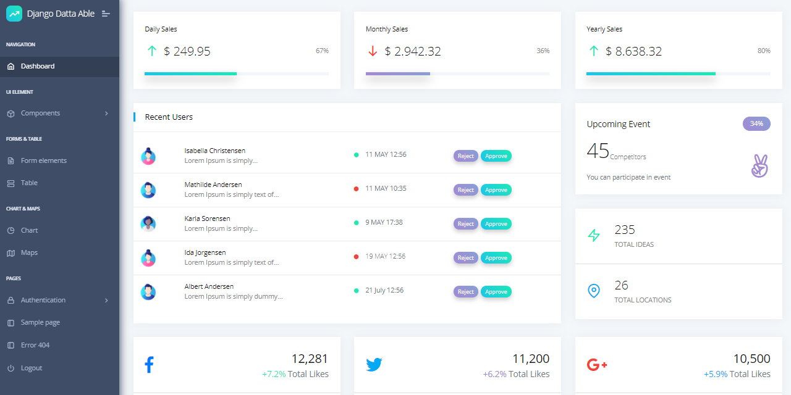

# Home

### What is [AppSeed](https://appseed.us/)  

[AppSeed](https://appseed.us/) is a platform that uses automation tools to generate _production-ready seed projects_ enhanced with basic modules, authentication, database, and deployment scripts on top of modern UI kits provided by our amazing partners: [Creative-Tim](https://appseed.us/agency/creative-tim), [CodedThemes](https://appseed.us/agency/codedthemes), [Themesberg](https://appseed.us/agency/themesberg), and other well-known [agencies](https://appseed.us/agency).  

Such projects can be used in many contexts by developers and designers:  

* Start a new project and code specific features on top of the existing codebase
* Extract and integrate the UI files into a legacy project
* Beginners can use the codebase for learning purposes     __ 

Starters are provided in different patterns and technologies under permissive \(MIT, LGPL\) or commercial licenses: 

* [Open-source dashboards](https://appseed.us/admin-dashboards/open-source) generated in [Flask](https://appseed.us/admin-dashboards/flask) and [Django](https://appseed.us/admin-dashboards/django)
* [Static sites](https://appseed.us/static-site) provided on top of 11ty and other popular SSGs. 
* [Web Apps](https://appseed.us/django) used for simple presentation projects for [Flask](https://appseed.us/apps/flask-apps) and [Django](https://appseed.us/django) 
* Full-Stack applications that use [Vue](https://appseed.us/apps/vuejs) and [React](https://appseed.us/apps/react) as frontend engines.  

### Support

Support is an important part of our business model. A good product, in order to be useful, should have good support. We are providing support for all our products using two tiers:

* **Free Support** via Github \(issues tracker\)
* **Email Support** &lt;_support @ appseed.us&gt;_ with a maximum 12h response time
* **24/7 LIVE Support** via [Discord](https://discord.com/invite/fZC6hup) - High Priority for commercial products 

### Sample Project

[Datta Able](https://appseed.us/admin-dashboards/django-datta-able), a popular open-source dashboard generated on top of a colorful design from CodedThemes. 

* [Datta Able Django](https://appseed.us/admin-dashboards/django-datta-able) ****- product page
* [Datta Able Django](https://django-datta-able.appseed-srv1.com/) - LIVE Deployment

**Where to go from here**

* Browse [AppSeed](https://appseed.us/) and find a starter for your next project
* Access the [support](https://appseed.us/support) page in case you need help 

