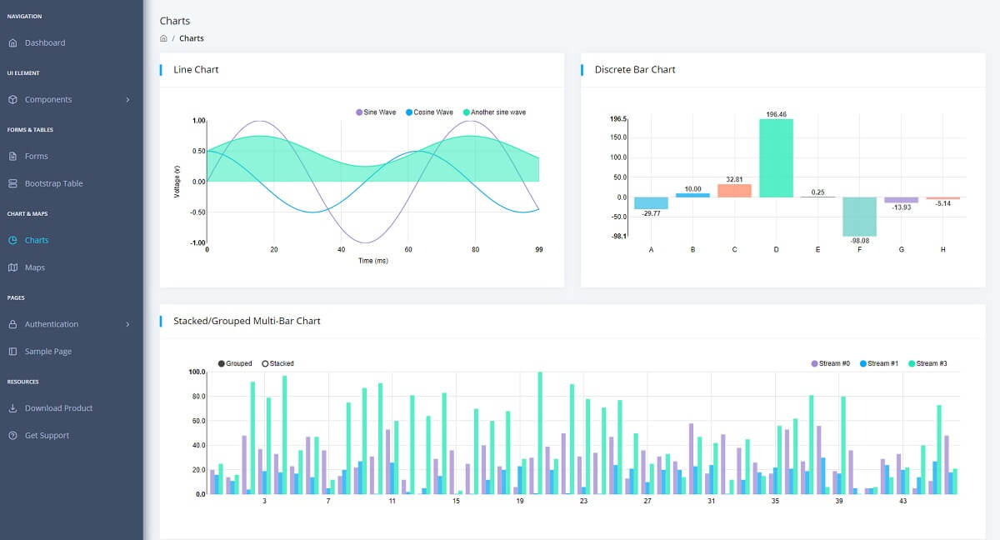

# API Server Django

Simple starter built with Python / Django Rest / Sqlite3 and JWT Auth. The authentication flow is based on **json web tokens**. The product comes with a simple, intuitive codebase, DRF integration, SQLite for persistence JWT Authentication API, Docker, and unitary tests.

> Version: **[v1.0.2](https://github.com/app-generator/api-server-django/releases)**, release date `2022-06-07` 

* [API Definition](api-unified-definition.md) - the unified API structure implemented by this server
* [Django API Server](https://github.com/app-generator/api-server-django) - source code
* Full-stack samples compatible with this product:
  * [React Berry Dashboard](https://github.com/app-generator/react-berry-admin-template) - open-source sample
  * [React Datta Dashboard](https://github.com/app-generator/react-datta-able-dashboard) - open-source sample

> API Methods - for full description please access [API Unified Definition](api-unified-definition.md)

* USERS API:
  * `/api/users/register`: create a new user
  * `/api/users/login`: authenticate an existing user
  * `/api/users/logout`: delete the associated JWT token
  * `/api/users/checkSession`: check an existing JWT Token for validity
  * `/api/users/edit` - edit the information associated with a registered user


## ✨ Requirements

* **Python3** (Python2 is not supported)
* **Django**==3.2.13
* **djangorestframework**==3.13.1
* **PyJWT**==2.4.0
* **django-cors-headers**==3.13.0
* **gunicorn**==20.1.0 (used by the Docker set up)


## ✨ How to use the code

> 👉 **Step 1** - Clone the sources

```
$ git clone https://github.com/app-generator/api-server-django.git
$ cd api-server-django
```

> 👉 **Step 2** - Create a virtual environment

```
$ virtualenv -p python3 venv
$ source venv/bin/activate
```

> 👉 **Step 3** - Install dependencies using `pip`

```
$ pip install -r requirements.txt
```

> 👉 **Step 4** - Start the API Server

```
$ python manage.py migrate
$ python manage.py runserver
```

The API server will start using the default port `8000`.


## ✨ **Docker execution**

> 👉 **Step 1** - Get the code

```
$ git clone https://github.com/app-generator/api-server-django.git
$ cd api-server-django
```

> 👉 **Step 2** - Start the app in Docker

```
$ docker-compose up -d --build
```

Visit `http://localhost:5000` in your browser. The API server will be running


## ✨ Compatible Fullstack Products

The product can be used as a standalone server but also as an authentication server for React, Vue products. Such a product already configured with Django API Server is [**React Datta Able**](https://appseed.us/product/react-node-js-datta-able)**,** an open-source React Dashboard.

* [React Datta Able](https://appseed.us/product/react-node-js-datta-able) - product page
* [React Datta Able](https://github.com/app-generator/react-datta-able-dashboard) - source code


