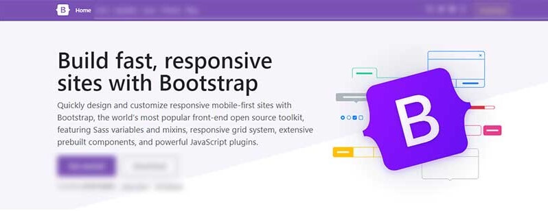

# Bootstrap Templates

**Bootstrap** is a free and open-source CSS framework directed at responsive, mobile-first front-end web development. It contains CSS- and (optionally) JavaScript-based design templates for typography, forms, buttons, navigation, and other interface components.

Bootstrap is a powerful toolkit - a collection of HTML, CSS, and JavaScript tools for creating and building web pages and web applications. It is a free and open-source project, hosted on GitHub, and originally created by Twitter.&#x20;

* [Bootstrap](https://getbootstrap.com/) - the official website
* [Short Bootstrap Tutorial](https://www.toptal.com/front-end/what-is-bootstrap-a-short-tutorial-on-the-what-why-and-how)
* [What is Bootstrap](https://wpamelia.com/what-is-bootstrap/) - a comprehensive introduction

