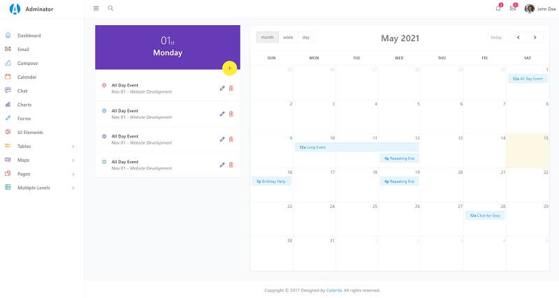

# Adminator

**Adminator** is a responsive Bootstrap 4 Admin Template. It provides you with a collection of _ready-to-use_ code snippets and utilities, custom pages, a collection of applications, and some useful widgets.

* [Adminator](https://github.com/puikinsh/Adminator-admin-dashboard) - source code
* [Adminator](https://colorlib.com/polygon/adminator/index.html) - LIVE Demo

For newcomers, [Adminator](https://appseed.us/admin-dashboards/django-dashboard-adminator) is provided by ColorLib, a well-known company involved in many ope-source products. Adminator has a modern UI and comes with a _state-of-the-art _tooling chain to compile the HTML files.


### How to compile the project

To use this modern design and compile in a local environment a [minimal development](../tutorials/minimal-programming-kit.md) kit is required:

* A modern editor - [VSCode](https://code.visualstudio.com)
* [Nodejs](https://nodejs.org/en/) - used in [Javascript](https://developer.mozilla.org/en-US/docs/Web/JavaScript)-based products and tools 
* [GIT](https://git-scm.com) - a command-line tool used to download sources from [Github](https://github.com)

Once we have all these tools accessible we can start compiling the product:

> **Step #1** - Clone the sources from the public repository

```
$ git clone https://github.com/puikinsh/Adminator-admin-dashboard.git
$ cd Adminator-admin-dashboard
```

> Step #2 - Install modules via NPM or Yarn

```
$ npm install
// OR
$ yarn
```

> Step #3 - Start the app in development mode (with LIVE Reloading)

```
$ npm run dev
// OR
$ yarn dev
```

If all goes well, we should see the app running in the browser:


