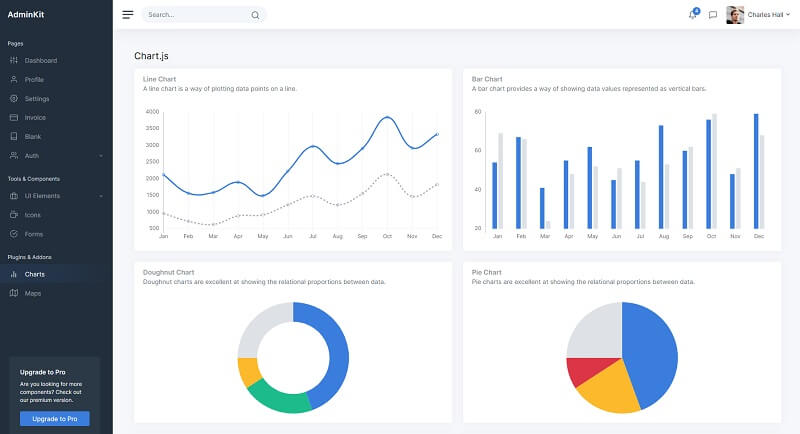

# AdminKit

A professional Admin & Dashboard template based on Bootstrap 5 that comes with hundreds of UI components, forms, tables, charts, pages, and icons. **AdminKit** **does not require jQuery** and neither does one of the 3rd party libraries AdminKit is using.

* [AdminKit](https://adminkit.io/) - product page
* [AdminKit](https://github.com/adminkit/adminkit) - Source Code (published on Github, MIT License)

This modern dashboard template has been generated by AppSeed in Flask and Django and released on Github under the MIT License.

* [AdminKit Flask](https://github.com/app-generator/flask-adminkit) - simple, open-source Flask Starter
* [AdminKit Django](https://github.com/app-generator/django-adminkit) - open-source Django Seed project


The product (HTML Version) can be used and compiled directly from Github by following the instructions provided in the README file - the [minimal development kit](../tutorials/minimal-programming-kit.md) required to build AdminKit:

* Mandatory: [NodeJs](https://nodejs.org/en/) (<= 10.x), [GIT](https://git-scm.com/)
* Optional (but recommended): [Python](https://www.python.org/), [Yarn](https://yarnpkg.com/), [Gulp](https://gulpjs.com/), [VsCode](https://code.visualstudio.com/)

Once all the tools are accessible we can start compiling the product:

> **Step #1** - Download Sources

```
$ git clone https://github.com/adminkit/adminkit.git
$ cd adminkit
```

> **Step #2** - Install modules

```bash
$ yarn
```

> **Step #3** - Start AdminKit in development mode

```bash
$ yarn start
```

If all goes well, we should see this modern Bootstrap 5 Template running in the browser



