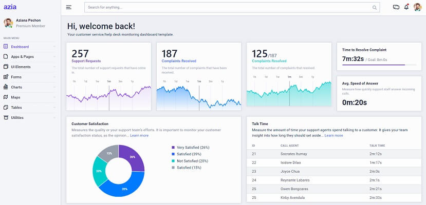

# Azia Dashboard PRO

**Azia Dashboard** is a Bootstrap 4 admin & dashboard template featuring components that are built to fit perfectly with each other. It offers a clean interface that can be easily adapted to fit your vision and branding. Azia features many essential utility classes that can help cut down CSS bloat and modify CSS components instantly. You will save a lot of time going from prototyping to full-functional code because all elements are implemented. **Azia Dashboard** is coming with pre-built examples, so the development process is seamless switching from our pages to the real website is very easy to be done.

* [Azia Dashboard PRO](https://bit.ly/2Lk6XNQ) - product page hosted by [BootstrapDash](../partners/bootstrapdash.md)
* **Product documentation** can be accessed on the [product page](https://bit.ly/2Lk6XNQ)  

**Azia PRO Features -** 10+ essential Pages to get you started FAST, modern light and dark layouts, Horizontal and Vertical layouts, plus Cross Browser Compatibility.

**Tooling -** Build on top of Bootstrap 4, the open-source CSS framework that ensures fast prototyping. SASS, a Preprocessor that outputs well-formatted standard CSS, SASS is extremely useful for fast coding.

