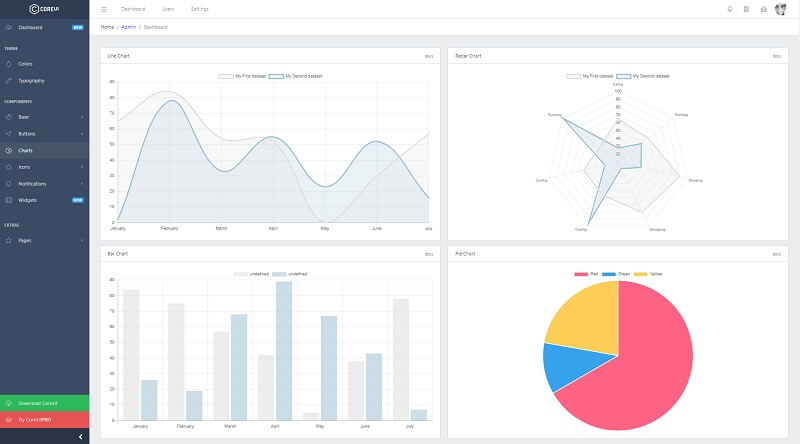

# CoreUI Template

CoreUI is an Open Source Bootstrap Admin Template. But CoreUI is not just another Admin Template. It goes way beyond hitherto admin templates thanks to transparent code and file structure. And if that's not enough, let’s just add that CoreUI consists bunch of unique features and over 1000 high-quality icons.

* [CoreUI](https://bit.ly/2VTDaxg) - the product page
* [CoreUI](https://github.com/coreui/coreui-free-bootstrap-admin-template) - source code published on Github

CoreUI is meant to be the UX game changer. Pure & transparent code is devoid of redundant components, so the app is light enough to offer the ultimate user experience. This means mobile devices also, where the navigation is just as easy and intuitive as on a desktop or laptop.

