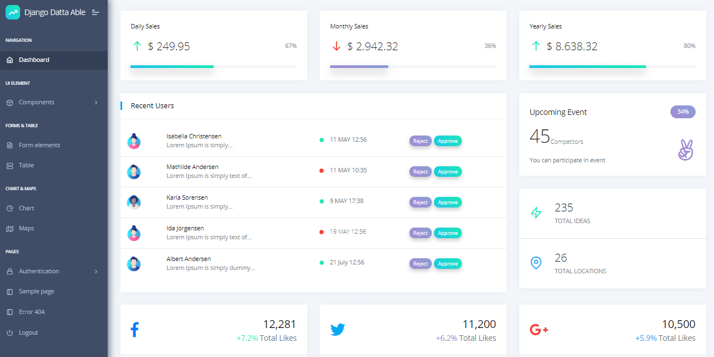

# Datta Able

**Datta Able** Bootstrap Lite is the most stylized Bootstrap 4 Lite Admin Template, around all other Lite/Free admin templates in the market. It comes with high feature-rich pages and components with fully developer-centric code. Before developing Datta Able our key points were performance and design.

**Datta Able** comes with error/bug-free, well structured, well-commented code and regularly updates which saves you a large amount of developing backend application time and it is fully customizable.

* [Datta Able](https://codedthemes.com/item/datta-able-bootstrap-lite/?ref=appseed) - product page \(hosted by CodedThemes\)
* [Datta Able](https://github.com/codedthemes/datta-able-bootstrap-dashboard) - Source code published on Github
* [Datta Able Flask](https://appseed.us/admin-dashboards/flask-datta-able) - simple Flask starter provided by AppSeed
* [Datta Able Django](https://appseed.us/admin-dashboards/django-datta-able) - generated by AppSeed

