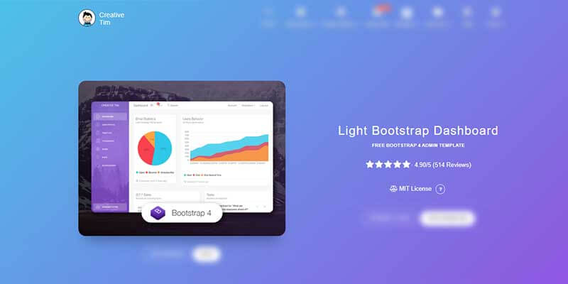

# Light Bootstrap Template

**Light Bootstrap Dashboard** is a Bootstrap 4 admin dashboard template designed to be beautiful and simple. It is built on top of Bootstrap 4 and it is fully responsive. It comes with a big collection of elements that will offer you multiple possibilities to create the app that best fits your needs. It can be used to create admin panels, project management systems, web applications backend, CMS, or CRM.

* [Light Bootstrap Dashboard](https://bit.ly/2ZEXOU3) - product page hosted by [Creative-Tim](../partners/creative-tim.md)
* [Light Bootstrap Dashboard](https://bit.ly/2SlJRtz) - LIVE demo
* [Light Bootstrap Dashboard](https://bit.ly/3tqTMLv) - product documentation

The product represents a big suite of front-end developer tools that can help you jump-start your project. We have created it thinking about things you actually need in a dashboard. **Light Bootstrap Dashboard** contains multiple handpicked and optimized plugins. Everything is designed to fit with one another. As you will be able to see, the dashboard you can access on Creative Tim is a customization of this product.

