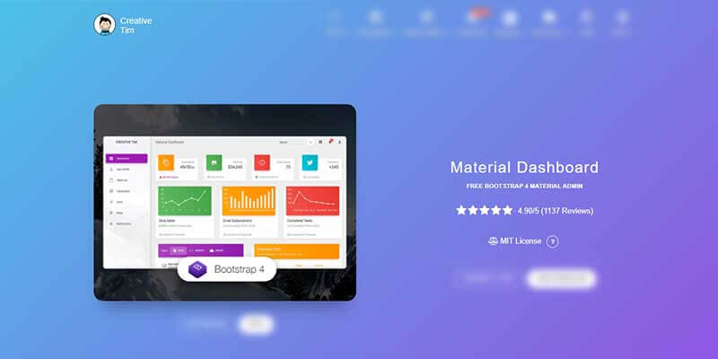

# Material Dashboard Template

Material Dashboard is a free Material Bootstrap 4 Admin with a fresh, new design inspired by Google's Material Design. We are very excited to introduce our take on the material concepts through an easy-to-use and beautiful set of components. Material Dashboard was built over the popular Bootstrap 4 framework and it comes with a couple of third-party plugins redesigned to fit in with the rest of the elements.

* [Material Dashboard](https://bit.ly/3fSPqaK) - product page hosted by [Creative-Tim](../partners/creative-tim.md)
* [Material Dashboard](https://bit.ly/3tmuqOt) - LIVE demo
* [Material Dashboard](https://bit.ly/2Rp9NUA) - product documentation

**Material Dashboard** makes use of light, surface, and movement. The general layout resembles sheets of paper following multiple different layers so that the depth and order is obvious. The navigation stays mainly on the left sidebar and the content is on the right inside the main panel.

