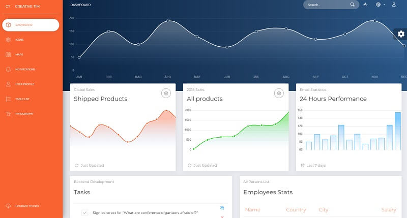
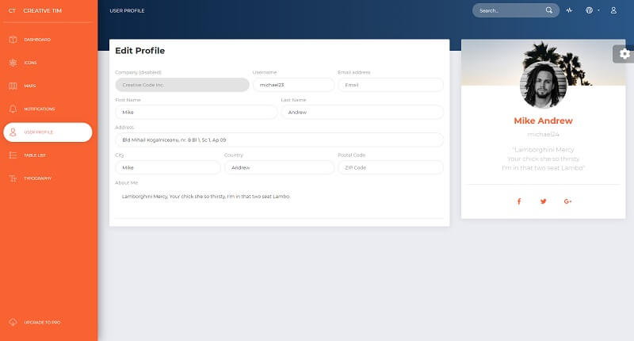

# Now UI Dashboard

**Now UI Dashboard** is a responsive Bootstrap 4 kit provided for free by **Invision** and [Creative-Tim](../partners/creative-tim.md). It combines colors that are easy on the eye, spacious cards, beautiful typography, and graphics.&#x20;

* [Now UI Dashboard](https://bit.ly/3oiWrWo) - product page
* [Now UI Dashboard](https://bit.ly/3tPYjaq) - LIVE demo

Now UI Dashboard comes packed with all plugins that you might need inside a project and documentation on how to get started. It is light and easy to use, and also very powerful. This makes starting a new project very simple. It also provides benefits if you are already working on a Bootstrap 4 project; you can just import the Now UI Dashboard style over it.&#x20;

Most of the elements have been redesigned; but if you are using an element we have not touched, it will fall back to the Bootstrap default.




### How to compile the project

To use this modern design and compile in a local environment a [minimal development](../tutorials/minimal-programming-kit.md) kit is required:

* A modern editor - [VSCode](https://code.visualstudio.com)
* [Nodejs](https://nodejs.org/en/) - used in [Javascript](https://developer.mozilla.org/en-US/docs/Web/JavaScript)-based products and tools&#x20;
* [GIT](https://git-scm.com) - a command-line tool used to download sources from [Github](https://github.com)

Once we have all these tools accessible we can start compiling the product:

> **Step #1** - Clone the sources from the public repository&#x20;

```
$ git clone https://github.com/creativetimofficial/now-ui-dashboard.git
$ cd now-ui-dashboard
```

> **Step #2** - Compile SCSS files&#x20;

```
$ gulp compile-scss
```

> **Step #3** - Start the template in browser

```
$ gulp open-app
```

If all goes well, we should see **Now UI Dashboard** running.


