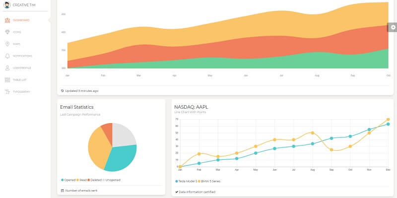
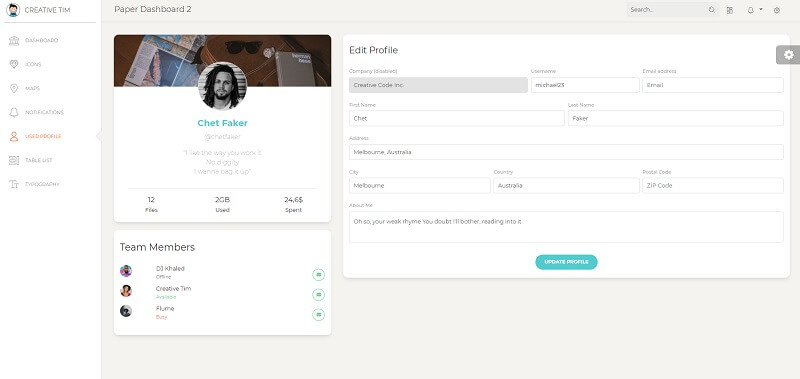

# Paper Dashboard

**Paper Dashboard 2** is a beautiful Bootstrap 4 admin dashboard with a large number of components, designed to look neat and organized. If you are looking for a tool to manage and visualize data about your business, this dashboard is the thing for you. It combines colors that are easy on the eye, spacious cards, beautiful typography, and graphics. Paper Dashboard 2 comes packed with all plugins that you might need inside a project and documentation on how to get started. It is light and easy to use, and also very powerful.

* [Paper Dashboard](https://bit.ly/3ol6Tg3) - product page
* [Paper Dashboard](https://bit.ly/3eNrlmU) - LIVE deployment

**Paper Dashboard 2** is built on top of Bootstrap 4, so it fully supports it. Most of the elements from the dashboard are re-designed to resemble sheets of paper and color pastels. If they are elements that we have not touched, they will gracefully fall back to the Bootstrap 4 default.




### How to compile the project

To use this modern design and compile in a local environment a [minimal development](../tutorials/minimal-programming-kit.md) kit is required:

* A modern editor - [VSCode](https://code.visualstudio.com/)
* [Nodejs](https://nodejs.org/en/) - used in [Javascript](https://developer.mozilla.org/en-US/docs/Web/JavaScript)-based products and tools 
* [GIT](https://git-scm.com/) - a command-line tool used to download sources from [Github](https://github.com/)

Once we have all these tools accessible we can start compiling the product:

> **Step \#1** - Clone the sources from the public repository

```text
$ git clone https://github.com/creativetimofficial/paper-dashboard.git
$ cd paper-dashboard
```

> **Step \#2** - Compile SCSS files

```text
$ gulp compile-scss
```

> **Step \#3** - Start the template in browser

```text
$ gulp open-app
```

If all goes well, we should see Paper Dashboard running.



