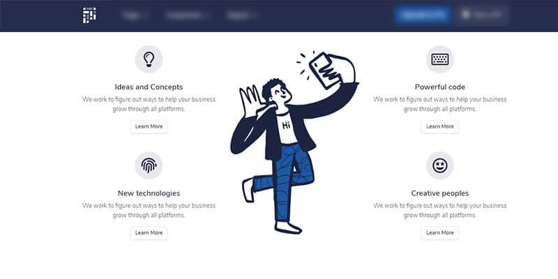

# Pixel Lite Template

Pixel is a free, fully responsive, and modern Bootstrap 4 UI Kit that will help you build creative and professional websites. Use our components and sections, switch some Sass variables to build and arrange pages to best suit your needs - provided by [Themesberg](../partners/themesberg.md).

* [Pixel Lite](https://themesberg.com/product/ui-kit/pixel-lite-free-bootstrap-4-ui-kit) - product page hosted by [Themesberg](../partners/themesberg.md)
* [Pixel Lite](https://themesberg.com/docs/pixel-bootstrap/getting-started/overview/) - official UI documentation

