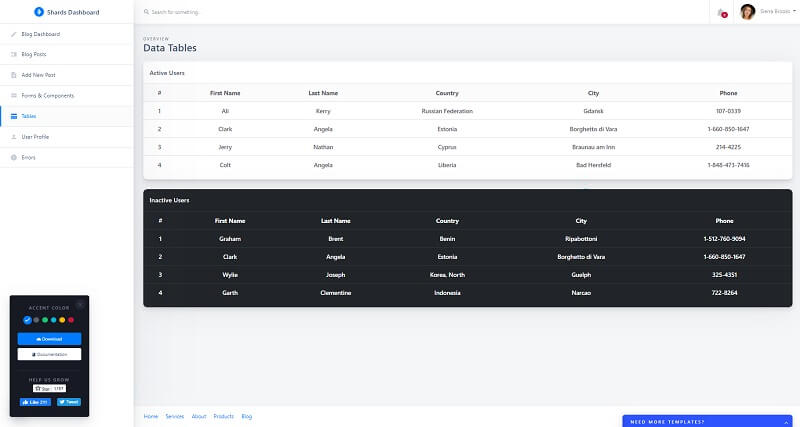

# Shards Dashboard

A high-quality & free Bootstrap admin dashboard template pack that comes with lots of templates and components. Based on Bootstrap 4, **Shards Dashboard Lite** is fully responsive and capable to adapt its layout to any viewport size.

* [Shards Dashboard Lite](https://designrevision.com/downloads/shards-dashboard-lite/) - product page
* [Shards Dashboard Lite](https://designrevision.com/demo/shards-dashboard-lite/) - LIVE deployment
* [Shards Dashboard Lite](https://github.com/DesignRevision/shards-dashboard) - source code

### Shards Features

**Fully Responsive** - Based on Bootstrap 4, Shards Dashboard Lite is fully responsive and capable to adapt its layout to any viewport size.

**Lightweight - P**erformance is excellent by adding a thin layer that’s only \~4kb mingz.

**Well Documented** - Fully documented components and features were one of the key points when building Shards Dashboard Lite so that you can focus on building your ideal product with ease.

