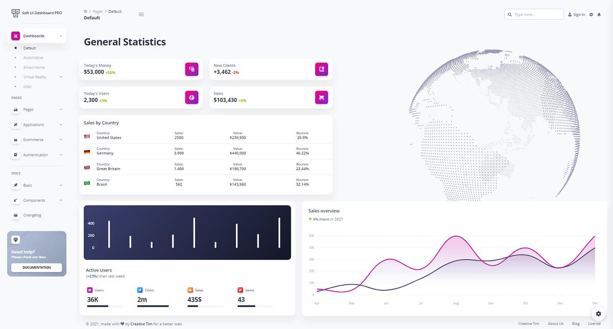
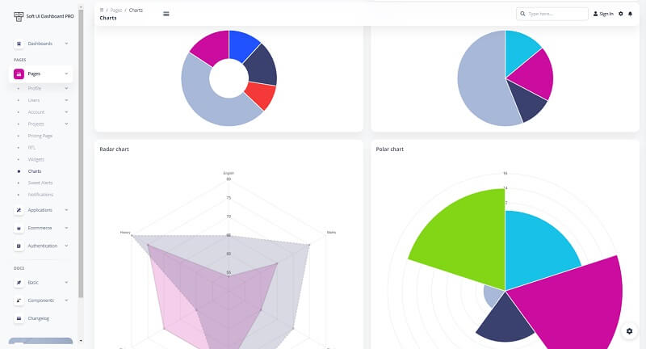
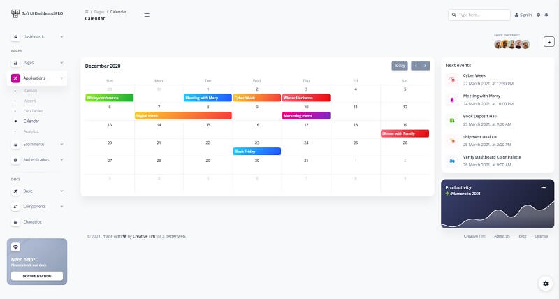

# Soft UI Dashboard PRO

**Soft UI Dashboard PRO** is the premium dashboard version of the Soft UI Design System. The product comes with an impressive UI, hundred of elements, designed blocks, and fully coded pages. For newcomers, Soft UI Design System is the latest and most innovative design from Creative Tim.

* [Soft UI Dashboard PRO](https://bit.ly/2RtSXVa) - product page
* [Soft UI Dashboard PRO](https://bit.ly/3vVUVwl) - LIVE Demo

### Official Product Description

Designed for those who like bold elements and beautiful websites, Soft UI Dashboard PRO is built with over 300 frontend individual elements, like buttons, inputs, navbars, nav tabs, cards, or alerts, giving you the freedom of choosing and combining.

This Premium **Bootstrap 5** Dashboard is coming with prebuilt design blocks, so the development process is seamless, switching from our pages to the real website is very easy to be done.

**Example Pages** - If you want to get inspiration or just show something directly to your clients, you can jump-start your development with our pre-built example pages. You will be able to quickly set up the basic structure for your web project.

> Soft UI Dashboard PRO - Full Calendar Page

Soft UI Dashboard PRO comes with an open-source version released under the MIT License that can be used for unlimited hobby and commercial products. For more information regarding the free version of this modern Bootstrap 5 design, please access:

* [Soft UI Dashboard](https://bit.ly/2Q1uIfK) - official product page
* [Soft UI Dashboard](soft-ui-dashboard.md) - more information provided by AppSeed
