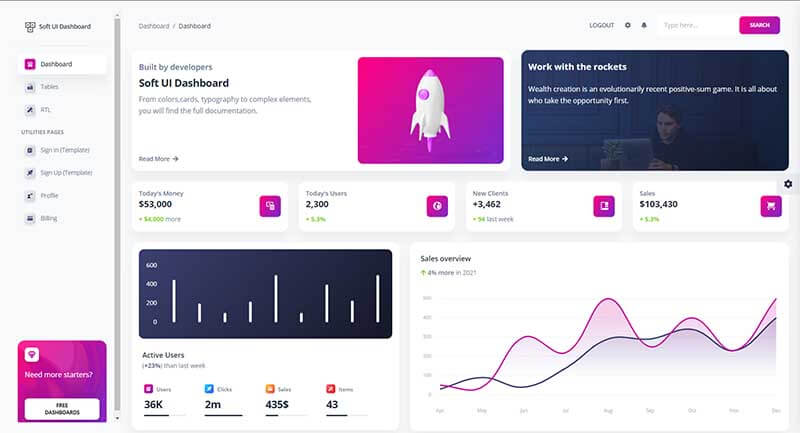
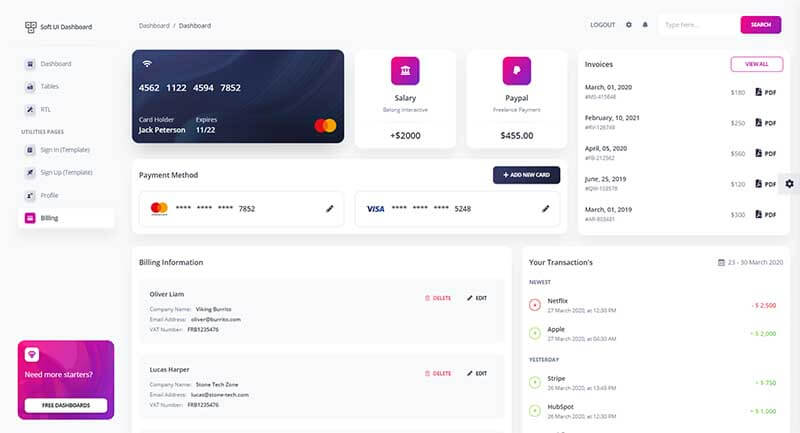

# Soft UI Dashboard

Designed for those who like bold elements and beautiful websites. Made of hundred of elements, designed blocks and fully coded pages, Soft UI Dashboard is ready to help you create stunning websites and webapps. 

* [Soft UI Dashboard](https://bit.ly/2Q1uIfK) - product page
* [Soft UI Dashboard](https://bit.ly/3dLM7CE) -  LIVE Demo

**UI Kit Features** - Soft UI Dashboard is built with over 70 frontend individual elements, like buttons, inputs, navbars, nav tabs, cards, alerts, giving you the freedom of choosing and combining. All components can take variations in color, that you can easily modify using SASS files and classes.

 **Example Pages -** If you want to get inspiration or just show something directly to your clients, you can jump-start your development with our pre-built example pages. You will be able to quickly set up the basic structure for your web project. 



### How to use the code

To compile and start the project in a local environment a [minimum programming kit](../tutorials/minimal-programming-kit.md) must be installed and accessible via the terminal:

* [Nodejs](https://nodejs.org/en/) - version 10.x or above
* [Yarn](https://yarnpkg.com/) - a smart package manager for Node
* [GIT](https://git-scm.com/) - versioning command-line tool
* [Gulp](https://gulpjs.com/) - toolkit automation 

Once we have all these tools installed and accessible via the terminal, we can move forward to clone the sources from the public repository, install modules and start the app in the browser.

> **Step \#1** - Clone sources

```bash
$ git clone https://github.com/creativetimofficial/soft-ui-dashboard.git
$ cd soft-ui-dashboard
```

> Step \#2 - Install modules \(this operation might take a while\)

```bash
$ yarn 
```

> Step \#3 - Start the app in browser

```bash
$ gulp open-app
```

If all goes well, Soft UI Dashboard should be visible in the browser. 



