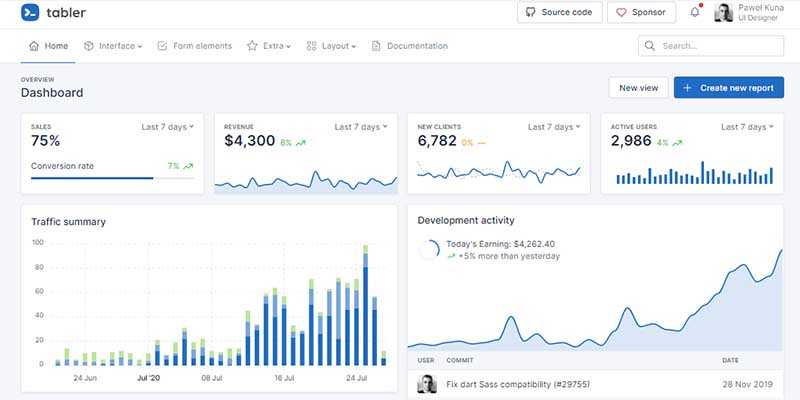

# Tabler Template

Tabler is a UI kit that speeds up the development process and makes it easier than ever! Built on the latest version of Bootstrap, it helps you create templates based on fully customizable and ready-to-use UI components, which can be used by both simple websites and sophisticated systems. With basic knowledge of HTML and CSS, you’ll be able to create dashboards that are fully functional and beautifully designed.

* [Tabler](https://github.com/admin-dashboards/bootstrap-template-tabler) - source code published on Github
* [Tabler](https://preview.tabler.io/) - LIVE deployment

**Coded by Developers -** Clear and telling code that you won't get lost in. It was made with care and loves so that you don't have to spend hours on making it work.

**Open-Source Code -** You can see the code of Tabler on its GitHub account. If you miss any feature feel free to create a pull request there, we'll definitely check it. 

 **Build with Bootstrap -** Tabler used Bootstrap, the most popular HTML, CSS, and JS framework. Thanks to this developers without experience can modify code without any problems.

