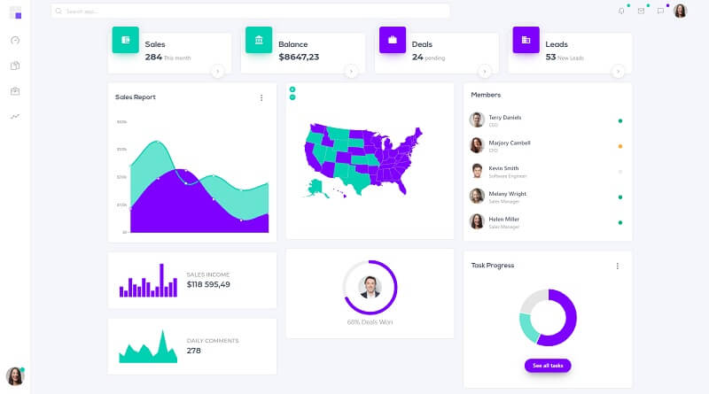

# Dashkit PRO v3

Dashkit is a modern dashboard styled with Bulma CSS crafted by CssNinja agency. Dashkit features a set of reusable data widgets and a set of social widgets. These widgets can be uses on every page of your dashboard.

> Note: This is a legacy version, for the latest version please access [Dashkit PRO v4](dashkit-pro.md)

* [Dashkit PRO v3](https://bulma-css.com/dashkit/) - hosted by [Bulma-CSS.com](https://bulma-css.com/)
* [Dashkit PRO v3](https://dashkit-pro.bulma-css.com/) - LIVE Demo



### How to compile DashKit <a id="how-to-compile-dashkit"></a>

Being a commercial product to get access to the source code please access the official page and purchase a license. Once you have the source code downloaded a [minimal programming kit](https://docs.appseed.us/content/tutorials/minimal-programming-kit) should be properly installed and accessible in the terminal.

* A modern editor - [VSCode](https://code.visualstudio.com/)​
* ​[Nodejs](https://nodejs.org/en/) - used in [Javascript](https://developer.mozilla.org/en-US/docs/Web/JavaScript)-based products and tools
* [Gulp](https://gulpjs.com/) - installed globally 

Once all the tools are installed we can start compiling the code.

> **Step \#1** - Change the directory inside the sources

```text
$ cd dashkit-pro
```

> **Step \#2** - Install modules via NPM or Yarn

```text
$ npm install
// OR
$ yarn
```

> Step \#3 - Compile the sources and generate the HTML files

```text
$ gulp dev
$ 
$ # Dashkit is now viewable at: http://localhost:3000
```

 If all goes well, we should see Dashkit PRO running in the browser.


