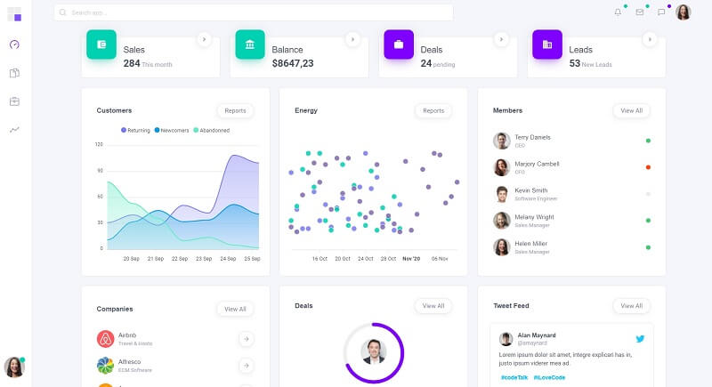
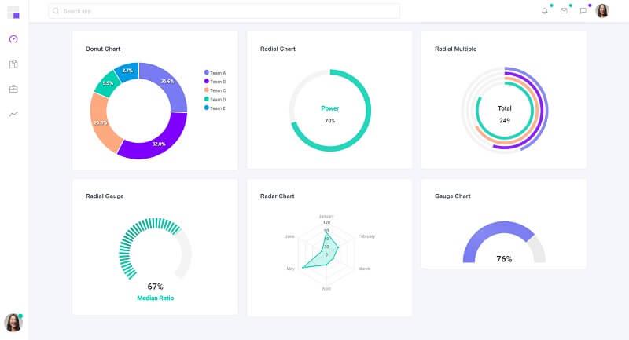

# Dashkit PRO

**Dashkit** is an incredible Bulma dashboard that comes with numerous customizable and reusable components. **Dashkit** features an amazing set of components to jumpstart your next project. The product is built with Bulma and Alpine JS and also features a Spruce JS store if you want to use it in your project.

* [Dashkit PRO](https://cssninja.io/product/dashkit) - product page hosted by CssNinja
* [Dashkit PRO](https://dashkit.cssninja.io/) - Live Demo

> Built with:

* [Bulma CSS](https://bulma.io/) v0.9.1
* [AlpineJs](https://github.com/alpinejs/alpine) - minimal framework for composing JavaScript behavior in your markup
* [Spruce](https://github.com/ryangjchandler/spruce) **-** lightweight state management layer for Alpine.js ****&#x20;




## Product Features

**Handcrafted UI** - Dashkit is not another generic template. It has a strong personality and is built with the Bulma CSS framework.

**Modular Code** - Dashkit's code is modular and lets you easily add and remove elements, to match your business specifications.

**Solid Layouts** -Multiple and different layouts are available to kickstart your app, like Chat, CRM and analytics products.   &#x20;


## How to compile DashKit

Being a commercial product to get access to the source code please access the official page and purchase a license. Once you have the source code downloaded a [minimal programming kit](../tutorials/minimal-programming-kit.md) should be properly installed and accessible in the terminal. &#x20;

* A modern editor - [VSCode](https://code.visualstudio.com/)
* [Nodejs](https://nodejs.org/en/) - used in [Javascript](https://developer.mozilla.org/en-US/docs/Web/JavaScript)-based products and tools

Once all the tools are installed we can start compiling the code.&#x20;

> **Step #1** - Change the directory inside the sources

```
$ cd dashkit-pro
```

> **Step #2** - Install modules via NPM or Yarn

```
$ npm install
// OR
$ yarn
```

> Step #3 - Compile the sources and generate the HTML files

```
$ npm run dev
// OR 
$ yarn dev
```

If all goes well, we should see Dashkit PRO running in the browser.


