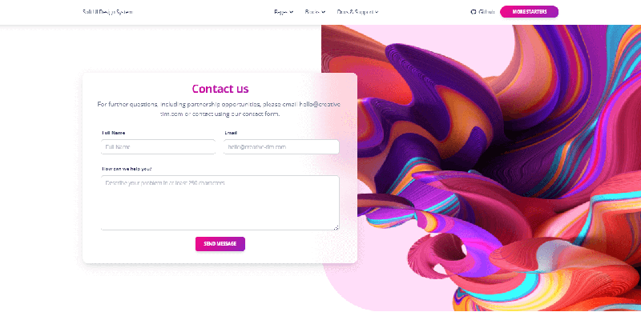
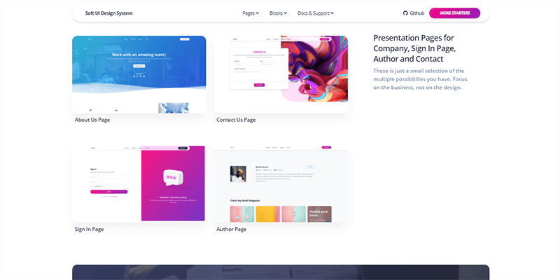
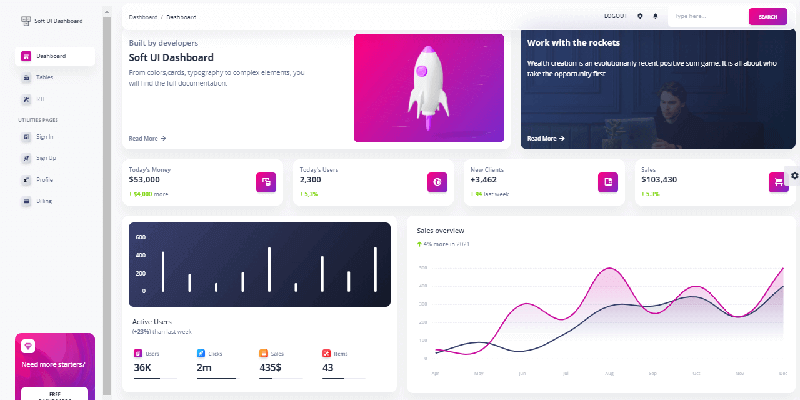

# Soft UI Design System

[Soft UI](https://appseed.us/ui-kit/soft-ui-design-system) is the most design system provided by Creative-Tim agency. Designed for those who like bold elements and beautiful websites, **Soft UI Design System** is made of hundreds of elements, designed blocks, and fully coded pages.&#x20;

* (Free) [Soft UI System](https://bit.ly/3v6JYIe) - product page hosted by [Creative-Tim](../partners/creative-tim.md)
* (Free) [Soft UI Dashboard](https://bit.ly/2Q1uIfK) - product page hosted by [Creative-Tim](../partners/creative-tim.md)
* [Soft UI System PRO](https://bit.ly/3730QW3) - the premium version of this design &#x20;

### Soft UI Design System

[Soft UI](https://appseed.us/ui-kit/soft-ui-design-system) Design System is built with over 70 frontend individual elements, like buttons, inputs, navbars, navtabs, cards or alerts, giving you the freedom of choosing and combining. All components can take variations in colour, that you can easily modify using SASS files and classes.

You will save a lot of time going from prototyping to full-functional code, because all elements are implemented. This Free Bootstrap 5 UK Kit is coming with prebuilt design blocks, so the development process is seamless, switching from our pages to the real website is very easy to be done.

&#x20;**Example Pages -** If you want to get inspiration or just show something directly to your clients, you can jump start your development with our pre-built example pages. You will be able to quickly set up the basic structure for your web project.

* [Soft UI Design System](https://bit.ly/3v6JYIe) - product page
* [Soft UI Design System](https://bit.ly/3nXZR0y) - LIVE Demo

### Soft UI Dashboard

[Soft UI](https://appseed.us/ui-kit/soft-ui-design-system) Dashboard is built with over 70 frontend individual elements, like buttons, inputs, navbars, navtabs, cards or alerts, giving you the freedom of choosing and combining. All components can take variations in colour, that you can easily modify using SASS files and classes. Used open-source plugins and libraries:  [Bootstrap 5](https://www.getbootstrap.com/) and  [Popper.js](https://popper.js.org/).&#x20;

* [Soft UI Dashboard](https://bit.ly/2Q1uIfK) - product page
* [Soft UI Dashboard](https://bit.ly/3dLM7CE) - LIVE Demo

&#x20;
