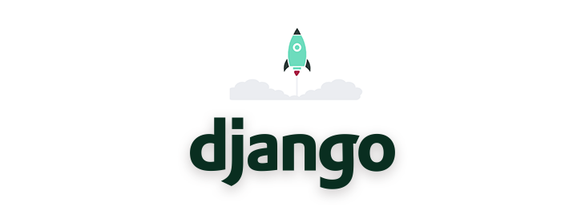
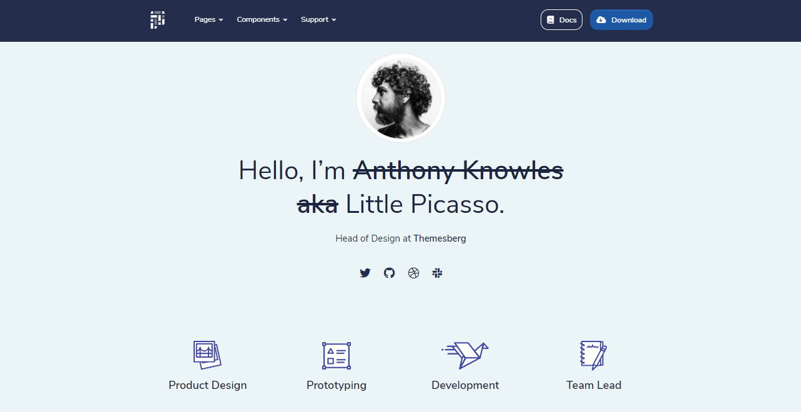

# Django Templates

This page is a comprehensive introduction to [**Django Template**](https://dev.to/sm0ke/django-templates-short-introduction-and-free-samples-2878) system, a modern and designer-friendly language for **Python** used to generate dynamic HTML pages. For newcomers, **Django** is a high-level Python Web framework that encourages rapid development by reusing modules and libraries built by experienced programmers. On top of this, **Django** is actively supported by an impressive **open-source** community - Github stats: 2k contributors, Used by **675k** Users, \~**58k** Stars.



Before start using Django Template System, we need to install Python, the language used to code Django, and of course, the Django framework.

> Install Python

The best way to install Python is to access the [download page](https://www.python.org/downloads/) and use the appropriate installer that matches the operating system. Once the installation process is completed we can check if Python is properly installed directly in the terminal:

```
$ python
Python 3.8.4 (tags/v3.8.4:dfa645a, Jul 13 2020, 16:46:45) ...
Type "help", "copyright", "credits" or "license" for more information.
>>>
```

The next step is to install Django using a virtual environment:

```
$ virtualenv env
$ source env/bin/activate
$
$ pip install django
```

> Create a simple Django project

Once Python and Django are installed, we can move forward in developing a Django application by creating a Django _project_.

```
$ django-admin startproject django_templates
```

This command will automatically create a `django_templates` folder in the current directory, and all the necessary files for a basic, but fully functioning **Django** website with an SQLite database. Being a `batteries-included` framework, Django scaffolds the project with working authentication and administration modules out-of-the-box. To use any of these default features a migration should be executed to create the necessary tables.

```
$ python manage.py migrate
```

Our new Django project can be started using the command:

```
$ python manage.py runserver
```

By default, Django embedded server starts on port `8000`.

## Django Templates Layer

The default configuration generated can be found in the `settings.py` file and should look quite similar to this code chunk:

```python
TEMPLATES = [
    {
        'BACKEND': 'django.template.backends.django.DjangoTemplates',
        'DIRS': [],
        'APP_DIRS': True,
        'OPTIONS': {
            'context_processors': [
                'django.template.context_processors.debug',
                'django.template.context_processors.request',
                'django.contrib.auth.context_processors.auth',
                'django.contrib.messages.context_processors.messages',
            ],
        },
    },
]
```

To enhance this default configuration with a template folder, we need to create the directory somewhere inside the project and update the configuration to inform Django about it.

> For simplicity, the`templates` folder will be created in the root of the project

```
$ mkdir templates
```

> Updated configuration

```python
TEMPLATES_DIR = os.path.join(BASE_DIR, "templates") # <-- new

TEMPLATES = [
    {
        'BACKEND': 'django.template.backends.django.DjangoTemplates',
        'DIRS': [TEMPLATES_DIR],   # <-- new
        'APP_DIRS': True,
        'OPTIONS': {
            'context_processors': [
                'django.template.context_processors.debug',
                'django.template.context_processors.request',
                'django.contrib.auth.context_processors.auth',
                'django.contrib.messages.context_processors.messages',
            ],
        },
    },
]
```

From this point, we should be able to load the files defined in the `templates` directory.

## Django Templates Language

Once the basic configuration is done, we can move forward and see how this template language can help us to build faster web projects. Here is a short list with features offered by the Django template system:

* Inject variables, Lists, classes into templates
* Filters to transform the information directly in the template in many ways
* Conditionals (test variable presence or value) `<div data-gb-custom-block data-tag="if">...</div>`
* Loops (iterate on lists) - `<div data-gb-custom-block data-tag="for">...</div>`
* Imports (components reuse) `<div data-gb-custom-block data-tag="include" data-0='header.html'></div>`
* Inheritance (extend page templates) `<div data-gb-custom-block data-tag="extends" data-0='base.html'></div>`
* Block Declaration `<div data-gb-custom-block data-tag="block">...</div>`

Let's iterate on each feature and check out the sample code:

> **Variables and lists**

Django template system knows how to render simple variables, class attributes, and even accessing the items of a list by index.

```python
{{ my_data }}          <-- simple variable
{{ address.street }}   <-- address is a class
{{ my_list.1 }}        <-- access list items by index    
```

> **Filters** - simple helpers useful to transform the information directly in the template

Here is a short-list with popular helpers: `upper`, `default value`, string `truncation`

```python
{{ name|upper }}             <-- Uppercase the name
{{ discount|default:"0" }}   <-- If discount is not provided, value 0 is used
{{ title|truncatechars:25 }} <-- Truncate the variable to the desired lenght
```

Another useful feature might be to use more than one filter over a variable:

```python
{{ name|lower|capfirst }} <-- name is lowecased 
                          <-- Capitalize first letter      
```

> **Comments** in Django templates

Django template system will ignore everything between `<div data-gb-custom-block data-tag="comment">` and `</div>`

```python

 

Here can be a long story    <-- Ignored by Django



```

> **Conditionals** - useful to test a variable presence or value

```python



    <span>Special Price {{ discount }}



    <span>Regular Price {{ price }}



    
```

> **Loops** - how to iterate on lists

```python
<ul>
    


        <li>{{ i }}</li>
    


</ul>
```

> Imports - components reuse

This feature is useful when we code large projects where parts of the UI are common to many pages, like the footer, top navigation, ..etc.

```markup
<h1>Django Templates</h1>
<p>
    This is just a simple file served from the "templates" directory.
</p>





 <-- Import directive
```

> **Template Inheritance** - allows to `extend` template with specific information

Template inheritance empowers the developer to build a base template that contains the common elements of your site and defines blocks that child templates can override like `page title`, highlight the active menu and other things specific to the current page.

**Base Template** Sample - saved as `base.html` in the templates directory

```python
<html>
  <head>
    <title>My Django 


 </title>
  </head>
  <body>
    <div class="container">
      <h2>This is from the base template</h2>
      <br>
      { block content }{ endblock }
      <br>
    </div>
  </body>
</html>
```

**Child template** - that `extends` the base template

```python
{ extends "base.html" }

{ block title } MySample { endblock }

{ block content }
  Cool content here
{ endblock }
```

When Django loads `child.html`, the `{ extends }` block informs the engine to merge the `base.html` template with the content provided by `child.html`.

* `{ block title }` becomes **MySample**
* `{ block content }` becomes **Cool content here**

## Django Template Sample

All the above concepts can be seen in action by accessing a simple Django seed project built on top of the latest Bootstrap version: [Pixel UI Django](https://appseed.us/django/django-pixel-bootstrap-uikit). This simple Django template can be downloaded and used for hobby and commercial products - for more information, please access:

* [Pixel Lite Django](https://appseed.us/product/pixel-bootstrap/django/) - product page
* [Pixel Lite Django](https://django-pixel-lite.appseed-srv1.com/) - LIVE demo



## Resources

* [Django Templates](https://www.geeksforgeeks.org/django-templates/) - a really nice article provided by GeeksForGeeks platform
* [Django Templates](https://bit.ly/3aStaNb) - provided by Creative-Tim and AppSeed
