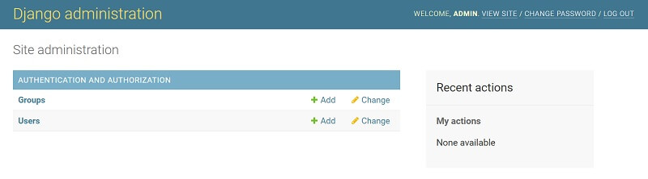

# Getting Started with Django

This page aims to help beginners getting started with Django, a popular web framework written in Python. 

### What is Django

Django is a modern web framework that comes with the "batteries-included" concept which means it provides modules and libraries for many common features required in modern web development:

* authentication flow \(login and register\)
* database access 
* powerful command-line interface \(CLI\)
* helpers to manage properly forms, models, and data validation
* flexible routing system
* built-in security patterns

Besides the common features and modules provided by Django core, this amazing framework is constantly improved by many open-source enthusiasts and also enhanced by other libraries coded to be used and integrated with ease in Django - the official Django links are below:

* [Django](https://www.djangoproject.com/) - official website
* [Django](https://docs.djangoproject.com/en/3.2/) - official documentation


### Tools and Environment

To start using Django a few tools and libraries are required. Being a Python library, to run properly Django requires Python to be executed without exceptions and fully complete its mission. On top of this, other tools are recommended for a full-featured Django environment:  

* [Python3](https://www.python.org/) - the latest actively supported version of Python
* [GIT](https://git-scm.com/) - a command-line tool used to download sources from [Github](https://github.com/)
* Basic knowledge in working with [virtual environments](https://docs.python.org/3/tutorial/venv.html)

> How to check Python installation

```bash
$ # Check Python version
$ python --version
Python 3.8.4
```

> Check GIT instalation

```bash
$ # Check GIT version
$ git --version
git version 2.28.0.windows.1
```

> How to create a **virtual environment**

```text
$ # Create a Virtual Environment
$ virtualenv env 
```

Virtual environments are useful to execute a Python project in isolation in a shared environment. 


### Install Django

Django can be installed in many ways and the most recommended way is to use PIP, the official Python package manager. Here is the complete list with commands 

```text
$ # Create the virtual environment
$ virtualenv env 
$
$ # Activate the virtual environment
$ source env/bin/activate
```

 For Windows-based systems, the activation command is different \(without calling `source`\):

```text
$ # Virtualenv modules installation (Windows based systems)
$ # virtualenv env
$ # .\env\Scripts\activate
```

 Once the Virtual Environment is up and running, we can install Django and start using it. 

```bash
$ pip install Django
```

How to check the installation:

```text
$ # Launch Python console
$ python 
>>> 
>>> import django
>>> django.__version__
'3.2.3'
```

 In this case, the installed version is `3.2.3`  the latest stable version.


### Build a Django project

Django help us to generate a project skeleton via a command-line utility command called _django-admin._ Let's use it and generate our first Django project: 

```text
$ Create Project folder
$ mkdir hellodjango 
$ cd hellodjango 
```

 Once our working directory is _hellodjango_ \(feel free to use another name\), the next step is to call _django-admin_ and generate the project:

```text
$ django-admin startproject config .
```

> Start the project

```text
$ python manage.py runserver 
```

If all goes well, our newly created Django app should be visible in the browser. 

The console will show the current execution status and a few warnings:

```text
$ You have 18 unapplied migrations ...
$ Run 'python manage.py migrate' to apply them.
```

Django migrations refer to the database state and tables. The application is provided with usable authentication by default and to make use of this _included feature,_ we need to run the database migration and create all required tables. 

```bash
$ python manage.py migrate 
```

> The output should be similar to this:

```text
Operations to perform:
  Apply all migrations: admin, auth, contenttypes, sessions
Running migrations:
  Applying contenttypes.0001_initial... OK
  Applying auth.0001_initial... OK
  Applying admin.0001_initial... OK
  Applying admin.0002_logentry_remove_auto_add... OK
  ...
  Applying auth.0012_alter_user_first_name_max_length... OK
  Applying sessions.0001_initial... OK
```

 

> ### Create a Django superuser

To access the manage all tables, users, and permissions Django comes with the "**superuser**" concept witch is like an admin or a **root** user for Unix. Let's create a **superuser** using the CLI:

```text
$ python manage.py createsuperuser
```

The command will ask for username, password, and email address. Once the process is completed, we can use the  **superuser** account to access the Django administration section:

> The admin section can be visited at **http://localhost:8000/admin**




### **Resources**

For more Django-related resource, please access:

* [Django](https://www.djangoproject.com/) - the official website
* A curated list with [Django apps](https://appseed.us/django) and [dashboards ](https://appseed.us/admin-dashboards/django) provided by AppSeed
* Ask for [support](https://appseed.us/support) using email and [Discord](https://discord.gg/fZC6hup) - for registered users

 

