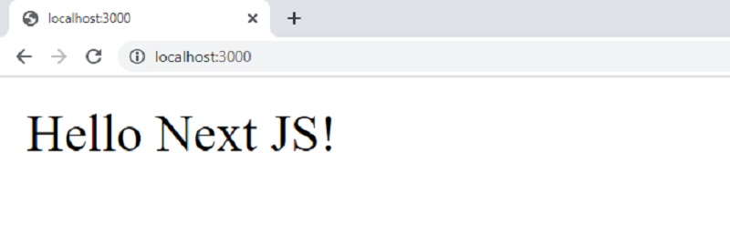

# Getting Started with Next JS

**Next JS** is a popular web framework built on top of React that provides _out-of-the-box_ many hot features used in modern web development: static and server rendering, smart bundling, Typescripts support without a complex configuration. 

* [Next JS](https://nextjs.org/)  - official website
* [Next JS](https://nextjs.org/docs) - documentation


To start using Next JS a [minimal programming kit](../tutorials/minimal-programming-kit.md) should be already installed with some of the tools:

* A modern editor - [VSCode](https://code.visualstudio.com/) or [Atom](https://atom.io/)
* [Nodejs](https://nodejs.org/en/) - used in [Javascript](https://developer.mozilla.org/en-US/docs/Web/JavaScript)-based products and tools
* [Yarn](https://yarnpkg.com/) - a popular package manager for NodeJS (better than [NPM](https://www.npmjs.com/))
* [GIT](https://git-scm.com/) - a command-line tool used to download sources from [Github](https://github.com/)

Once we have this minimal set of tools, we can install **Next JS** using npm or **Yarn**.

```bash
$ npm install nextjs@latest
$ npm install react@latest react-dom@latest
// OR
$ yarn add nextjs
$ yarn add react@latest react-dom@latest
```


## Hello World in Next JS

In this section, a simple **Hello World** project will be created using the console and a code editor.

> The source code can be downloaded from Github: [Next JS Hello](https://github.com/app-generator/hello-world-next-js)

**Step #1** - Create project directory

```bash
$ mkdir hello-nextjs
$ cd hello-nextjs
```

**Step #2** - Execute `npm init` to generate package.json for our project with minimal information:

```bash
$ npm init
This utility will walk you through creating a package.json file.
... 
```

During the process, we can use the defaults for all questions. In the end, `npm` will ask to confirm the information and the file is saved.

**Step #3** - Install dependencies

```bash
npm install next react react-dom
# OR
yarn add next react react-dom
```

**Step #4** - Create a simple page

**Next JS** expects the React content in the `pages` directory and our simple page is saved in this location.

```javascript
// pages/index.js
import React from "react";
export default () => ( < div > Hello Next JS! < /div>);
```

**Step #5** - Added scripts to the `package.json` file

```javascript
// Contents of package.json
...
    "scripts": {
        "test": "echo \"Error: no test specified\" && exit 1",
        "dev": "next dev",
        "build": "next build",
        "start": "next start"
    }
...    
```

Once we have saved the file, we can start this simple open-page Next JS project:

```bash
$ yarn dev
```

The command will print a few messages in the terminal and serve the page on port `3000`

```bash
$ next dev
ready - started server on 0.0.0.0:3000, url: http://localhost:3000
event - compiled successfully
event - build page: /next/dist/pages/_error
wait  - compiling...
event - compiled successfully
event - build page: /
wait  - compiling...
```

By visiting the project in the browser, we should see our `Hello World` message:



A Real Next JS Sample

Obviously, the above sample is pretty simple and minimal, just to make curious the audience. In this section is mentioned a production-ready **Next JS** sample released by Creative-Tim as an open-source project.

> [Next JS Material Kit](https://bit.ly/37l2piJ) - is a modern UI Kit for Next JS

**Next JS Material Kit** is a Free Material Design Kit made for NextJS, React, and Material-UI. Next JS Material Kit is built with over 100 individual frontend elements, giving you the freedom of choosing and combining. All components can take variations in color,  which you can easily modify using SASS and JSS (inside JS files) files and classes.

> How to build the project

**Step #1** - access the [product page](https://bit.ly/37l2piJ) and download/unzip the code

The product can be downloaded from the public repository: [Next JS Material](https://github.com/creativetimofficial/nextjs-material-kit) (Github).

**Step #2** - Change the current directory inside the project and install dependencies

```
$ npm install 
// OR
$ yarn
```

Once the depenedencies are installed, we can start the project in development mode:

```bash
$ npm run dev
// OR
$ yarn dev
```

If all goes well, we should see the project running in the browser on port `3000` (the default port):


## Special Pages

Being a flexible framework, NextJS allows us to define special page handlers used globally across the project:

> Custom "Document"  used to augment your application's `<html>` and `<body>` tags.

To override the default `Document`, and define properties like `lang` we need to create the file `./pages/_document.js`

> `App.js` allows us to wrap ALL pages in a special wrapper and use a persistent layout across all pages.

Using this special page, we can achieve with ease a few useful things:

* Layout persistence between page changes
* Use a global CSS
* Preserve the app state when navigating app pages

> Custom error pages - 404/500 Error Handlers

Next JS provides a 404 error page by default but in the same time allows us to overwrite it via   `pages/404.js` file. The same thing we can do to handle with a custom page the 500 Error case.

For more information regarding the Next JS customization, please access:

* Next JS - [Custom document](https://nextjs.org/docs/advanced-features/custom-document) section
* Next JS - [Custom Error Pages](https://nextjs.org/docs/advanced-features/custom-error-page)
* Next JS - [Custom App](https://nextjs.org/docs/advanced-features/custom-app)


## Resources

* [Next JS Handbook](https://www.freecodecamp.org/news/the-next-js-handbook/) - a comprehensive tutorial | **Freecodecamp**
* More [Next JS Starters](https://bit.ly/3noTq5Q) - provided by Creative-Tim
* [Next JS Templates](https://dev.to/sm0ke/next-js-templates-a-curated-list-56fo) - a curated list | **Dev.to**
