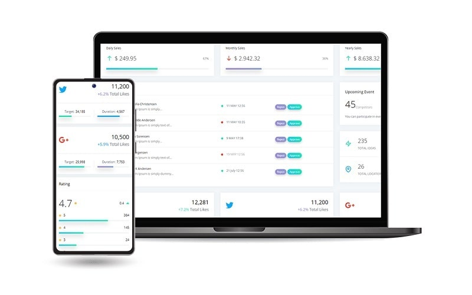

# ImportError: cannot import name 'safe\_str\_cmp' from 'werkzeug.security'

[Werkzeug](https://werkzeug.palletsprojects.com/en/2.1.x/), the core dependency of **Flask**, is a comprehensive [WSGI](https://wsgi.readthedocs.io/en/latest/) web application library. Version **v2.1.0** deprecates a few helpers, including `safe_str_cmp.` Here is the update history:

**v2.0.0**

> `pbkdf2_hex`, `pbkdf2_bin`, and `safe_str_cmp` are deprecated. `hashlib` and `hmac` provide equivalents.

**v2.1.0**&#x20;

> Remove the `pbkdf2_hex`, `pbkdf2_bin`, and `safe_str_cmp` functions. Use equivalents in `hashlib` and `hmac` modules instead.

### How to Fix

Freeze the `Werkzeug`  to the latest stable version prior to v2.1.0. The recommended version is **Werkzeug==2.0.3.**&#x20;

## [Black Friday](https://appseed.us/discounts/) - `75%OFF`

> The [campaign](https://appseed.us/discounts/)  is active until `30.NOV` and applies to all products and licenses.

<figure><figcaption>
Black Friday - 75%OFF 
</figcaption></figure>

### Sample Project

To see this hot fix in action, feel free to check this sample project saved on Github (MIT License)

> [Flask Datta Able](https://appseed.us/admin-dashboards/flask-datta-able) - open-source Flask Starter generated by AppSeed

* 👉 [Datta Able Flask](https://github.com/app-generator/flask-datta-able) - Source Code
* 👉 [Datta Able Flask](https://flask-datta-able.appseed-srv1.com/) - LIVE deployment

