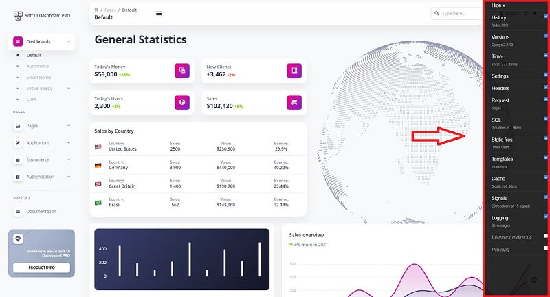

# Django - Add Debug Toolbar

This page explains how to add [Django Debug Toolbar](https://django-debug-toolbar.readthedocs.io/en/latest/index.html) to an existing Django project. For newcomers, the **Django Debug Toolbar** is a configurable set of panels that bumps various information about the current request/response when clicked.

* [Django Debug Toolbar](https://github.com/app-generator/django-add-debug-toolbar) - open-source sample published on Github 

### How to install

> **Step \#1** - Add `django-debug-toolbar` to project dependencies or install via PIP

```text
# File: requirements.txt
...
django-debug-toolbar
...
```

Or install via PIP

```text
pip install django-debug-toolbar
```

> **Step \#2** - Update project routes

```python
# File core/urls.py

import debug_toolbar   # <-- NEW                     

from django.contrib import admin
from django.urls import path, include  

urlpatterns = [
    path('admin/', admin.site.urls),          
    
    path('__debug__/', include(debug_toolbar.urls)),  # <-- NEW
    
    path("", include("authentication.urls")), 
    path("", include("app.urls"))             
]

```

> **Step \#3** - Update Settings

```python
# File core/settings.py
...
from decouple import config
from unipath import Path
import dj_database_url

import mimetypes                      # <-- NEW


BASE_DIR = Path(__file__).parent

INSTALLED_APPS = [
    'django.contrib.sessions',
    'django.contrib.messages',
    'django.contrib.staticfiles',
    'debug_toolbar',                   # <-- NEW
    'app'  
]

MIDDLEWARE = [
    'django.contrib.auth.middleware.AuthenticationMiddleware',
    'django.contrib.messages.middleware.MessageMiddleware',
    'django.middleware.clickjacking.XFrameOptionsMiddleware',
    'debug_toolbar.middleware.DebugToolbarMiddleware',         # <-- NEW
]

INTERNAL_IPS = [                     # <-- NEW
    '127.0.0.1',                     # <-- NEW
]                                    # <-- NEW

def show_toolbar(request):           # <-- NEW
    return True                      # <-- NEW 

DEBUG_TOOLBAR_CONFIG = {                     # <-- NEW
    "SHOW_TOOLBAR_CALLBACK" : show_toolbar,  # <-- NEW
}                                            # <-- NEW

if DEBUG:                                                      # <-- NEW
    import mimetypes                                           # <-- NEW          
    mimetypes.add_type("application/javascript", ".js", True)  # <-- NEW
```


> **Step \#4** - Execute the migration

```bash
$ python manage.py makemigrations
$ python manage.py migrate
```


> **Step \#5** - Start the app \(the debug toolbar should be visible\)

```bash
$ python manage.py runserver
```

At this point, the Debug Toolbar should be visible on the right side for all pages. 



### Resources

* [Django Debug Toolbar](https://django-debug-toolbar.readthedocs.io/en/latest/installation.html) - official docs
* [Django Debug Toolbar](https://pypi.org/project/django-debug-toolbar/) - PyPi page
* Troubleshooting
  * [Django Debug Toolbar not showing up](https://stackoverflow.com/questions/10517765/django-debug-toolbar-not-showing-up) - StackOverflow article
  * [Cannot get django-debug-toolbar to appear](https://stackoverflow.com/questions/28984239/cannot-get-django-debug-toolbar-to-appear/48873389) -  StackOverflow article 

