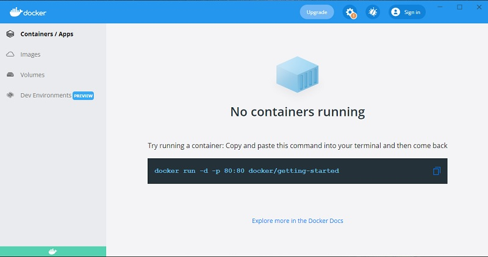

# Install Docker on Windows

Docker is an open platform for developing, shipping, and running applications. Docker enables you to separate your applications from your infrastructure so you can deliver software quickly.

### System requirements <a href="#system-requirements" id="system-requirements"></a>

* Windows 11 64-bit
* Windows 10 64-bit
* [Install WSL](install-wsl.md) (Windows Subsystem for Linux)
  * Execute `wsl --install Ubuntu`&#x20;
  * Execute `wsl --set-version Ubuntu 2` to use version 2


### Download the installer

Access the [download page](https://www.docker.com/products/docker-desktop) and download the installer. Double-click **Docker Desktop Installer.exe** and execute the installer.&#x20;

> When prompted, ensure the **Enable Hyper-V Windows Features** or the **Install required Windows components for WSL 2** option is selected on the Configuration page.   &#x20;


### Start Docker Desktop

Docker Desktop does not start automatically after installation. To start Docker Desktop we need to locate the app in the `Windows` menu and start the service.&#x20;

If all goes well we should be able to execute this test command in the terminal and also access the UI:&#x20;

```bash
docker run -d -p 80:80 docker/getting-started
```



