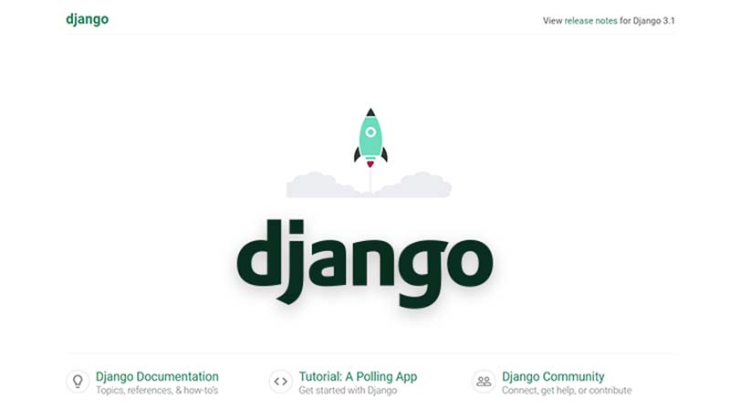

# Django MySql Database

**Django** is a leading Python web framework built by experts using a `bateries-included` concept. Being such a mature framework **Django** provides an easy way to switch from the default SQLite database to other database engines like **MySql**, PostgreSQL, or Oracle. For newcomers, **MySql** is a powerful open-source relational database where the information is correlated and saved in one or more tables.

### Django Database System

Django provides a generic way to access multiple database backends using a generic interface. In theory, Django empowers us to switch between DB Engines without updating the SQL code. The default SQLite database usually covers all requirements for small or demo projects but for production use, a more powerful database engine like **MySql** or **PostgreSQL** is recommended. 

The database settings are saved in the file referred by `manage.py` file. For all Django starters, this file is saved inside the `core` directory:

```bash
< PROJECT ROOT >
   |
   |-- manage.py         # Specify the settings file 
   | 
   |-- core/             # Implements app logic and serve the static assets
   |    |-- settings.py  # Django app bootstrapper
   |    |-- wsgi.py      # Start the app in production
   |    |-- urls.py      # Define URLs served by all apps/nodes
```

Let's visualize the contents of the `settings.py` file that configures the database interface. 

```python
# File: core/settings.py
...
DATABASES = {
    'default': {
        'ENGINE': 'django.db.backends.sqlite3',
        'NAME'  : 'db.sqlite3',
    }
}
...
```

The above snippet is provided by when Django scaffolds the project. We can see that the **SQLite** driver is specified by the `ENGINE` variable. 

### Update for MySql

To use MySql as the backend engine for a Django project, we need to follow a simple setup:

* Install the **MySql Server** \(we can also use a remote one\)
* Install the **Mysql** Python driver - used by Django to connect and communicate
* Create the Mysql database and the user 
* Update settings Django
* Execute the Django migration and create the project tables


### Install MySql Server

The installation process is different on different systems but this phase should not be a blocking point because Unix systems provide by default a MySql server and for Windows, we can use a visual installer.  For more information please access the download page and select the installer that matches your operating system:

* [MySql](https://www.mysql.com/) - official website
* [MySql Downloads](https://dev.mysql.com/downloads/) page

### 

### Install the Python Driver

To successfully access the Mysql Engine, Django needs a driver \(aka a connector\) to translate the Python queries to pure SQL instructions. 

```bash
$ pip install mysqlclient
```

The above instruction will install the Python MySql driver globally in the system. Another way is to use a `virtual environment` that sandboxes the installation. 

```bash
$ # Create and activate the virtual environment
$ virtualenv env
$ source env/bin/activate
$ 
$ # install the mysql driver
$ pip install mysqlclient
```

### 

### Create the MySql Database

During the initial setup, Django creates the project tables but cannot create the database. To have a usable project we need the credentials used later by the Django project. The database can be created visually using a database tool \(like [MySQL Workbench](https://www.mysql.com/products/workbench/)\) or in the terminal:

```bash
CREATE DATABASE mytestdb;
```

> Create a new Mysql user

```bash
$ CREATE USER 'test'@'localhost' IDENTIFIED BY 'Secret_1234';
```

> Grant all privilegies to the newly created user

```bash
GRANT ALL PRIVILEGES ON `mytestdb` . * TO 'test'@'localhost';
FLUSH PRIVILEGES; 
```

### 

### Update Django Settings

Once the MySql database is created we can move on and update the project settings to use a MySql server.

```python
# File: core/settings.py
...
DATABASES = {
    'default': {
        'ENGINE'  : 'django.db.backends.mysql', # <-- UPDATED line 
        'NAME'    : 'mytestdb',                 # <-- UPDATED line 
        'USER'    : 'test',                     # <-- UPDATED line
        'PASSWORD': 'Secret_1234',              # <-- UPDATED line
        'HOST'    : 'localhost',                # <-- UPDATED line
        'PORT'    : '3306',
    }
}
...
```


### Start the project

The next step in our simple tutorial is to run the Django migration that will create all necessary tables. 

```bash
$ # Create tables
$ python manage.py makemigrations
$ python manage.py migrate
```

> Start the Django project

```bash
$ # Start the application (development mode)
$ python manage.py runserver
```

At this point, Django should be successfully connected to the Mysql Server and we can check the database and list the newly created tables during the database migration. 



