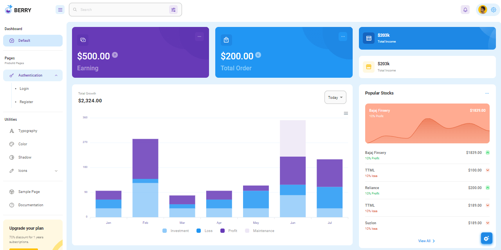
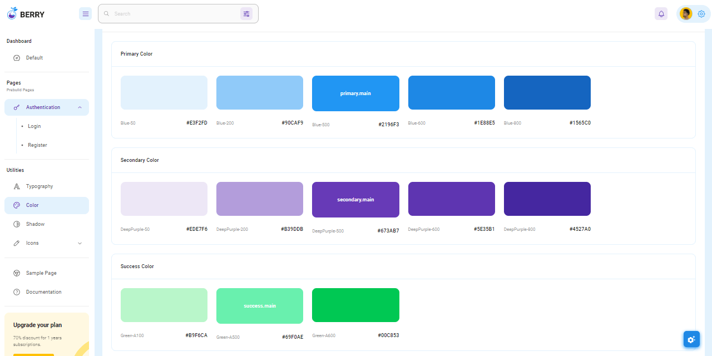
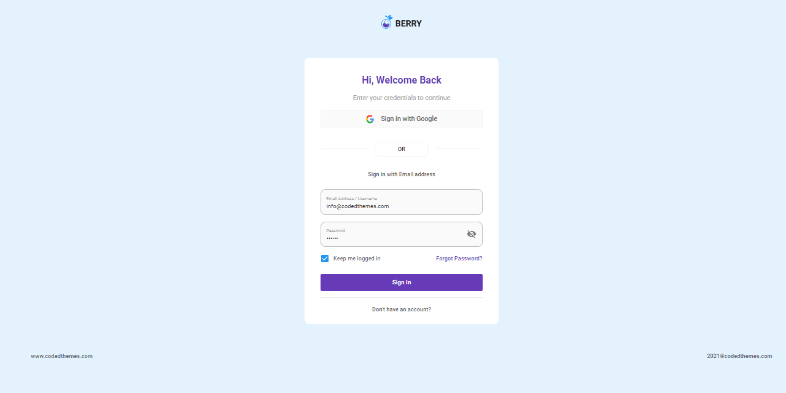

# Berry React Dashboard

Berry is a creative yet minimal free react admin template build using the Material UI. It is meant to be the best User Experience with highly customizable. It is a complete game-changer React Dashboard Template with easy and intuitive responsive design as on retina screens or laptops.

* [Berry React Dashboard](https://github.com/codedthemes/berry-free-react-admin-template) - source code (MIT License)
* [Berry React Dashboard PRO](https://berrydashboard.io/?ref=appseed) - more components and pages
* Free [React Dashboards](https://dev.to/sm0ke/react-dashboards-open-source-apps-1c7j) - a curated list published on Dev.to




### How to build the project

To compile this modern starter we need a decent Nodejs version (>= 10.x), GIT command tool and a good network connection (packages installation might take a while).

> Step 1 - Download the sources from the public repository

```bash
$ git clone https://github.com/codedthemes/berry-free-react-admin-template.git
$ cd berry-free-react-admin-template
```

> Step 2 - Install modules (via Npm or Yarn)

```bash
$ npm run install # via NPM 
```

We can use [Yarn](https://yarnpkg.com) as an alternative&#x20;

```bash
$ yarn
```

> Step 3 - Start the Berry Template

```bash
$ yarn start
```

If all goes well, we should see Berry Template running in the browser:





