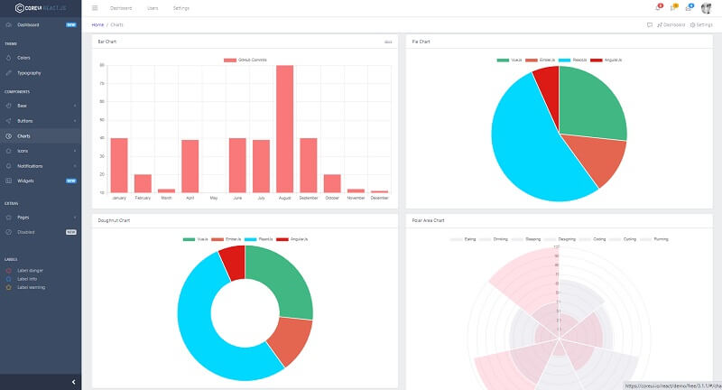

# CoreUI React

**CoreUI** is an Open Source **React** Template meant to be the UX game changer. Pure & transparent code is devoid of redundant components, so the app is light enough to offer the ultimate user experience. CoreUI React Admin Template is delivered with a ready-to-use environment, so you don't have to waste time configuring the project. All build scripts and tools are ready to use `out-of-the-box`.

* [CoreUI React](https://coreui.io/react/?AFFILIATE=128200) - product page
* [CoreUI React](https://coreui.io/react/demo/free/3.1.1/#/dashboard?AFFILIATE=128200) - LIVE Deployment
* [CoreUI Open-source starters](https://www.admin-dashboards.com/coreui-open-source-products/) - a curated list with free resources that use **CoreUI** Design&#x20;


**Core Features** - CoreUI React Admin Panel is compatible with Bootstrap, but Boostrap based components have been built from scratch as true React.js hook components (no jQuery dependencies).

**React Hooks** - All components in CoreUI React.js v3 are React hook components. For newcomers, Hooks are functions that let you “hook into” React state and lifecycle features from function components.

**Easy to use** - UI Components and Widgets are written with readability in mind, they are comparatively short and easy to understand. CoreUI React Admin Template is based on CoreUI Components Library with beautifully handcrafted UI Components designed by a team of our experienced designers.


### How to build the project

To compile this **React** starter we need a decent Nodejs version (>= 10.x), GIT command tool, and a good network connection (packages installation might take a while).

> **Step #1** - Download CoreUI sources from the public repository

```bash
$ git clone https://github.com/coreui/coreui-free-react-admin-template.git
$ cd coreui-free-react-admin-template
```

> **Step #2** - Install modules (via Npm or Yarn)

```bash
$ npm run install # via NPM 
```

We can use [Yarn](https://yarnpkg.com/) as an alternative&#x20;

```bash
$ yarn
```

> Step 3 - Start the Core Template in development mode

```bash
$ yarn start
```

If all goes well, we should see the CoreUI React template running in the browser:




> Links & Resources

* Free [React Dashboards](https://dev.to/sm0ke/react-dashboards-open-source-apps-1c7j) - a curated list published on Dev
* More [Open-source Dashboards](https://appseed.us/admin-dashboards/open-source) provided by AppSeed&#x20;
