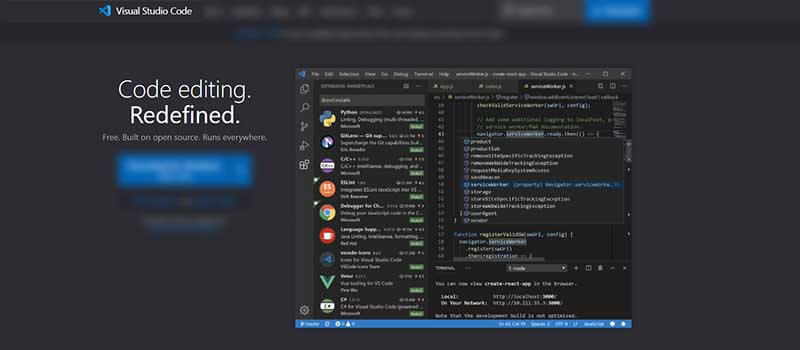

# Django For Beginners

This tutorial aims to help beginners getting started with Django, a popular Web Framework written in Python.  To get maximum from this content, the audience should be familiar with a terminal and have a minimal set of tools already installed. [Python3](https://www.python.org), a modern code editor ([VsCode](https://code.visualstudio.com), [Atom](https://atom.io)), and [GIT](https://git-scm.com) versioning command-line tool should be enough to experiment with all the code.

### Install Python

The core of dependency for Django is Python and we should install the interpreter first. Most of the systems come with Python already installed and we can easily check in the terminal:

```
$ python --version
Python 3.8.4       <-- All Good     
```

If the version displayed in the terminal is Python2, please note that this version [has been discontinued](https://www.python.org/doc/sunset-python-2/) for versioning and development since Jan.2020. To download and install Python access the [official page](https://www.python.org/downloads/), select the installer that matches the operating system, and follow the installation setup. Once the process is finished, recheck the Python version in the terminal.&#x20;

### Manage Dependencies&#x20;

With **Python** up and running, we can install Django and other modules required by our development. The recommended way to install and manage the dependencies for a Python project is to use a virtual environment, a safe way to isolate the dependencies across multiple projects.&#x20;

```
$ # Linux-based systems
$ virtualenv env
$ source env/bin/activate  
```

For Windows-based systems, the syntax is slightly different:

```
$ virtualenv env
$ .\env\Scripts\activate
```

> Let's install Django, using PIP (official package manager for Python)

```
$ pip install django
```

The above command will install the latest stable version of Django. From this point, we can use all tools provided by Django to create a new project, apps and manage the project via Django CLI.&#x20;

### Install a Code Editor

This section has plenty of options from the old-school (yet modern) [Vim](https://www.vim.org/download.php) to [VsCode](https://code.visualstudio.com) and [Atom](https://atom.io). For those unfamiliar with any of these tools, VsCode might be a good choice to get started fast.&#x20;

* [VSCode](https://code.visualstudio.com) - official website
* [VSCode](https://code.visualstudio.com/Download) - download page



### Build a Django Project

A new project can be generated with ease in Django by using _django-admin_ that provides a collection of settings for the database, Django, and security layer.

> Create the project folder

```bash
$ mkdir my-django-project
$ cd my-django-project
```

&#x20;  Inside the directory, we will generate the core of our project using _django-admin tool :_

```
$ django-admin startproject config .
```

&#x20;  **Note**: Take into account that `.` at the end of the command_._&#x20;

> Create the database and the app tables

```
$ python manage.py makemigrations
$ python manage.py migrate
```

> Start the application

```
$ python manage.py runserver 
$
$ # Access the web app in browser: http://127.0.0.1:8000/
```

At this point we should see the default Django page in the browser:&#x20;


### Create New Application

In the previous section, we've generated the core of the project that handles the configuration and now we will create the first Django application to serve a simple page to the users.&#x20;

```
$ python manage.py startapp app
```

> Add a new route - edit `app/views.py`&#x20;

```python
from django.shortcuts import render
from django.http import HttpResponse     # <-- NEW

def hello(request):                      # <-- NEW    
    return HttpResponse("Hello Django")  # <-- NEW   
```

The next step is to inform Django that we've created a new app and update the routing to include the new definition.&#x20;

> Update the configuration to include the new app - `core/settings.py`

```python
# File: config/settings.py (partial content)
...
INSTALLED_APPS = [
    'django.contrib.admin',
    'django.contrib.auth',
    'django.contrib.contenttypes',
    'django.contrib.sessions',
    'django.contrib.messages',
    'django.contrib.staticfiles',
    'app'                           # <-- NEW
]
...
```

> Update the routing rules as below - `core/urls.py`

```python
# File: config/urls.py (partial content)
...
from django.contrib import admin
from django.urls import path
from django.conf.urls import include, url   # <-- NEW
from app.views import hello                 # <-- NEW

urlpatterns = [
    path('admin/', admin.site.urls),
    url('', hello),                         # <-- NEW
]
```

After saving all changes we should no longer see the Django default page (the one with the green rocket): &#x20;

.png>)

### Create New Model

Even simple applications require minimal storage for persistent data. Django provides _out-of-the-box_ an SQLite database, just to help us start fast. During this section, we will create and interact with a new table (model).&#x20;

> Visualize the default SQL settings - `config/settings.py`

```python
# File: config/settings.py (partial content)
...
DATABASES = {
    'default': {
        'ENGINE': 'django.db.backends.sqlite3',
        'NAME': BASE_DIR / 'db.sqlite3',
    }
}
... 
```

&#x20;The `ENGINE` specify the technology used to manage the database. In our case is a lightweight (yet powerful) SQLite engine. `NAME` informs Django where to save the database on the filesystem.&#x20;

> **Define a new model** `Books` in `sample` application. The below changes should be added to `sample/models.py`:

```python
# File: sample/models.py

from django.db import models                       

class Book(models.Model):                                 # <- NEW
    title            = models.CharField(max_length=100)   # <- NEW 
    author           = models.CharField(max_length=100)   # <- NEW
    publication_date = models.DateField()                 # <- NEW 
```

**Tip** - for a quick check over the latest changes we can run `check` subcommand.

```
$ python manage.py check
System check identified no issues (0 silenced).  
```

> **Generate the SQL code** (`migrate` the database).

```
$ python manage.py makemigrations  # generate the SQL code
Migrations for 'sample':
  sample\migrations\0001_initial.py
    - Create model Book 
```

> **Apply changes on the database**

```
$ python manage.py migrate
Operations to perform:
  Apply all migrations: admin, auth, contenttypes, sample, sessions
Running migrations:
  Applying sample.0001_initial... OK 
```

> **Use the model via CLI**

Once the model is created we can use it via the Django shell:

```python
$ python manage.py shell
>>> 
>>> from sample.models import Book     # import the Book model in our context
>>> from django.utils import timezone  # used to provide the value for publication_date
>>>
>>> book1 = Book(title='The Adventures of Tom Sawyer', author='Mark Twain', publication_date=timezone.now() )
>>> book1.save()                       # save the new book

```

> **List all items (books)** (using the CLI)

```python
$ python manage.py shell
>>> 
>>> from sample.models import Book
>>> Book.objects.all()
<QuerySet [<Book: Book object (1)>]>
```

We can see our new book returned by the query. Let's improve the information that describes the object.

> **Django Model** - add text representation of an object

To achieve this goal, we should define the `__str__()` method for the `Book` model

```python
# File: sample/models.py

from django.db import models                       

class Book(models.Model): 
    title            = models.CharField(max_length=100) 
    author           = models.CharField(max_length=100)
    publication_date = models.DateField() 

    def __str__(self):       # <- NEW
        return self.title    # <- NEW

```

Let's restart the Django console and check the results:

```python
$ python manage.py shell
>>> 
>>> from sample.models import Book
>>> Book.objects.all()
<QuerySet [<Book: The Adventures of Tom Sawyer>]>

```

###

### Using Admin Section

**Django** comes by default with a usable admin dashboard that allows us to manage all app models and users with ease.  In order to access the module, a `superuser` should be created using the Django CLI:

> Create Django Superuser

```python
$ python manage.py createsuperuser
sername (leave blank to use 'test'): admin
Email address: test@appseed.us
Password: ********
Password (again): ********
Superuser created successfully. 
```


CRUD (create, read, update, delete) actions are provided for all default models (users, groups) shipped by Django. To register the new models, `Books` in our case, we need just a few lines of code.&#x20;

> Register `Book` model to be visible in the `admin` section

```python
# File: sample/admin.py

from django.contrib import admin

from .models import Book        # <- NEW

admin.site.register(Book)       # <- NEW 
```

&#x20; After this small change in our code, we should see `Books` model listed in the admin page:

.png>)

> Django Admin - Edit Book Items

.png>)


> Thanks for reading! For more topics, feel free to [contact](https://appseed.us/support) Appseed.&#x20;


### Resources

* Read more about [Django](https://www.djangoproject.com) (official docs)
* Start fast a new project using _development-ready_ [Django Starters](https://appseed.us/admin-dashboards/django)&#x20;
