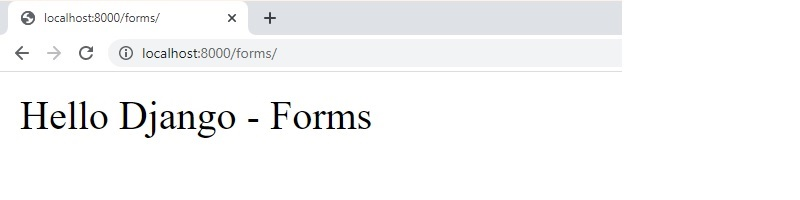
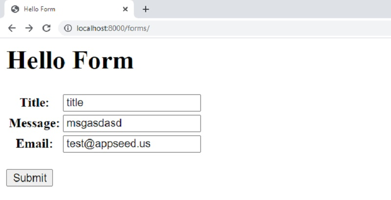
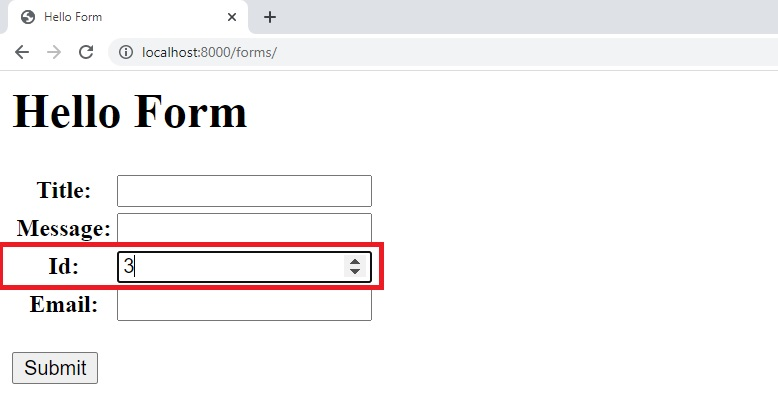

# Django Forms

This page explains how to **manage and validate a form in Django** Framework. We assume the audience has already a Django project up and running. For those that start from nothing, feel free to access the resources mentioned below and come back here once the content is understood:

* [How to install Django](django-how-to-install.md) - simple, tested steps to install Django
* [Django for beginners](django-for-beginners.md) - a comprehensive tutorial that covers the basics

> Topics covered by this tutorial

* Create a new Django app
* Define a new route&#x20;
* Update the configuration to include the new application
* Code a simple form
* Visualize the form using **Django shell**
* Integrate the Form into a real page
* Update the controller to check the form is validated

### Create a new Application

> For this, we will use the `startapp` Django subcommand:

```bash
$ python manage.py startapp forms
```

> Add a simple view in forms - `forms/views.py`

```python
# File contents: forms/views.py

from django.shortcuts import render

from django.http import HttpResponse 

def index(request):                                  
    return HttpResponse("Hello Django - Forms")
```

> Define the routing for our new app - `forms/urls.py` &#x20;

```python
from django.urls import path, re_path
from forms import views

urlpatterns = [

    # The home page
    path('forms/', views.index, name='home'),
]
```

> Update settings to include the new app - `config/settings.py`

```python
# File: config/settings.py (partial content)
...
INSTALLED_APPS = [
    'django.contrib.admin',
    'django.contrib.auth',
    'django.contrib.contenttypes',
    'django.contrib.sessions',
    'django.contrib.messages',
    'django.contrib.staticfiles',
    'forms'                           # <-- NEW
]
...
```

> Update routing - `config/urls.py`

```python
from django.contrib import admin
from django.urls import path, include  # <-- UPDATED to add 'include'    

urlpatterns = [
    path('admin/', admin.site.urls),
    path(""      , include("forms.urls")), # Forms app routing
]
```

Once we restart the project, the new route `/forms` should be visible:



### Define a new form

Inside the newly created app, we need to create a `forms` file and define the new Form Class object.

```python
# File contents: forms/forms.py

from django import forms 
 
class HelloForm(forms.Form): 

    title   = forms.CharField() 
    message = forms.CharField() 
    email   = forms.EmailField(required=False) 
```

After the file is saved, we can play with it using **Django CLI.**

```python
$ python .\manage.py shell
>>> 
>>> from forms.forms import HelloForm
>>> 
>>> my_form = HelloForm()
>>> 
>>> print( my_form.as_ul() )
<li><label for="id_title">Title:</label> <input type="text" name="title" required id="id_title"></li>
<li><label for="id_message">Message:</label> <input type="text" name="message" required id="id_message"></li>
<li><label for="id_email">Email:</label> <input type="email" name="email" id="id_email"></li>
```

Using the CLI we can visualize how the form will be expended and presented to the users. Another helper provided by Django is `form.as_p()` - the `paragraph` view of a form.

```python
>>> 
>>> print( my_form.as_p() )  
<p><label for="id_title">Title:</label> <input type="text" name="title" required id="id_title"></p>
<p><label for="id_message">Message:</label> <input type="text" name="message" required id="id_message"></p>
<p><label for="id_email">Email:</label> <input type="email" name="email" id="id_email"></p>
>>> 
```

The next step is to add the necessary code to display the form on a page and manage the information submitted by users in a controller.&#x20;

> Controller code - `forms/forms.py`  - `index` method

```python
from .forms      import HelloForm

def index(request):                                  
       

    if request.method == 'POST': 
        form = HelloForm(request.POST) 
        if form.is_valid(): 
            return HttpResponse("Form is valid")
            
    else: 
        form = HelloForm() 

    return render(request, 'hello.html', {'form': form}) 
```

> HTML page - defined in `forms/templates` forlder

```markup
<!-- Forms/templates/hellp.html: partial content -->

    <form action="" method="post"> 
        <table> 
            {{ form.as_table }} 
        </table> 
         
        <br />
        <input type="submit" value="Submit"> 
    </form> 
```



If all fields are provided, on submit, we should see the `Form is valid` message. &#x20;

> Update the form with a new field `ID` (numeric type):

```python
from django import forms 
 
class HelloForm(forms.Form): 

    title   = forms.CharField()
    message = forms.CharField() 
    id      = forms.IntegerField()              # <-- NEW form field  
    email   = forms.EmailField(required=False) 
```

> The page server to the users is updated automaticaly to include the new field




> Thanks for reading! For more topics, feel free to [contact](https://appseed.us/support) Appseed.&#x20;


### Resources&#x20;

* Read more about [Django](https://www.djangoproject.com) (official docs)
* Start fast a new project using _development-ready_ [Django Starters](https://appseed.us/admin-dashboards/django)&#x20;
