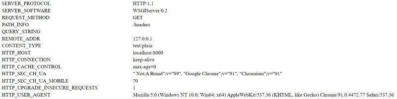

# Django Request Object

This page explains the `request` object provided by Django as the default argument in views. For those unfamiliar with Django, this web framework is written in Python by experienced developers using a **batteries-included** concept. For more information regarding this amazing web framework please access:

* [How to install Django](django-how-to-install.md) - simple, tested steps to install Django
* [Django for beginners](django-for-beginners.md) - a comprehensive tutorial that covers the basics

Let's create a Django project and a code our first view where the `request` object is exposed:

> Create and activate a virtual environment

```text
$ # Linux-based systems
$ virtualenv env
$ source env/bin/activate  
```

For Windows-based systems, the syntax is slightly different:

```text
$ virtualenv env
$ .\env\Scripts\activate
```

> Install Django - using PIP

```text
$ pip install django
```

The above command will install the latest stable version of Django.

### Build a Django Project <a id="build-a-django-project"></a>

A new project can be generated with ease in Django by using _django-admin_ that provides a collection of settings for the database, Django, and security layer.

> Create the project folder

```text
$ mkdir my-django-project
$ cd my-django-project
```

 Inside the directory, we will generate the core of our project using _django-admin tool :_

```text
$ django-admin startproject config .
```

 **Note**: Take into account that `.` at the end of the command_._

> Create the database and the app tables

```text
$ python manage.py makemigrations # generate SQL
$ python manage.py migrate        # Apply changes on database   
```

> Start the application

```text
$ python manage.py runserver 
$
$ # Access the web app in browser: http://127.0.0.1:8000/
```

At this point we should see the default Django page in the browser:


### Create New Application

In the previous section, we've generated the core of the project that handles the configuration and now we will create the first Django application to serve a simple page to the users. 

```text
$ python manage.py startapp app
```

> Update settings to include the new app - `config/settings.py`

```python
# File: config/settings.py (partial content)
...
INSTALLED_APPS = [
    'django.contrib.admin',
    'django.contrib.auth',
    'django.contrib.contenttypes',
    'django.contrib.sessions',
    'django.contrib.messages',
    'django.contrib.staticfiles',
    'app'                           # <-- NEW
]
...
```

> Update routing - `config/urls.py`

```python
# File: config/urls.py (partial content)
...
from django.contrib import admin
from django.urls import path
from django.conf.urls import include, url   # <-- NEW
from app.views import hello                 # <-- NEW

urlpatterns = [
    path('admin/', admin.site.urls),
    url('', hello),                         # <-- NEW
]
```

> Code out first route and get access to the `request` object

```python
from django.shortcuts import render
from django.http import HttpResponse     # <-- NEW

def hello(request):                      # <-- NEW    
    return HttpResponse("Hello Django")  # <-- NEW   
```


### Request Object Properties

The `request` object in Django comes with a few intresting properties: 

| Item / Helper | Sample Value | Short Information |
| :--- | :--- | :--- |
| REMOTE\_ADDR | 12.245.68.71 | IP of the client |
| HTTP\_USER\_AGENT | Mozilla/5.0 | User Browser Information |
| request.path | /admin/ | The URL without domain |
| request.is\_secure\(\) | True / False | True if request was made over HTTPS |
| request.method | POST / GET | The Request Method  |

> How to check the request type in view.

A widely user code chunk is when we test the type of the request and manage the submitted data on `POST` \(when we send information to the server, login action for instance\):

```python
from django.shortcuts import render
from django.http import HttpResponse     

def hello(request):

    if request.method == 'GET':    
        return HttpResponse("Received a GET request")
        
    elif request.method == 'POST':    
        return HttpResponse("Received a POST request")
```

For newcomers, `GET` is used to pull information from the server without altering anything. Search is a good example of a `GET` request when we try to locate an information on Google or Wikipedia. 

`POST` is used to update the information on the server like change the title for a book or register a new item in our service.

Another difference between `GET` and `POST` is the location of the submitted information. 

* GET submits data in URL: `http://myservice.com?search=all_book`
* POST submits data in request body \(not visible in the URL\)

> List all request headers

This subsection constains a code sample that print all headers and request objects provided by Django:

```python
def headers(request): 
    values = request.META.items() 
    
    rows = ''
    for key, val in values:
        rows += '<tr><td>%s</td><td>%s</td></tr>' % (key, val)

    return HttpResponse( '<table>' + rows + '</table>' )
```

Here is the script output executed using a local development server:



### Read Request Variables

Django provides dictionaries for `GET` and `POST` requests populated with all variables sent by the client. We can access the variables by `key` or using `get()` helper for both cases. 

> Read **GET variables**

```python
def parse_get(request):
    
    var1 = request.GET['my_var']       # this might throw KeyError exception
    
    var2 = request.GET.get('var_2')    # Soft read on variable
    
    var3 = request.GET.get('var_3', 1) # Soft Read with Default value     
```

> For **POST,** the process is identical. ****

```python
def parse_post(request):
    
    post_var1 = request.POST['my_var']       # this might throw KeyError exception
    
    post_var2 = request.POST.get('var_2')    # Soft read on variable
    
    post_var3 = request.POST.get('var_3', 9) # Soft Read with Default value     
```


> Thanks for reading! For more topics, feel free to [contact](https://appseed.us/support) Appseed.


### Resources 

* Read more about [Django](https://www.djangoproject.com/) \(official docs\)
* Start fast a new project using _development-ready_ [Django Starters](https://appseed.us/admin-dashboards/django) 

