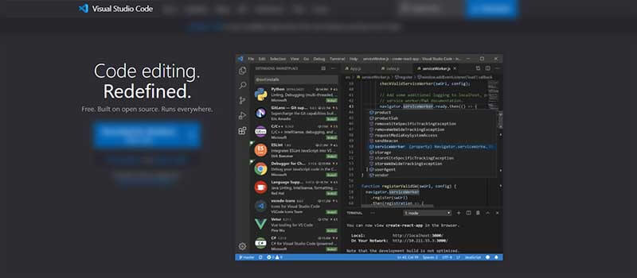
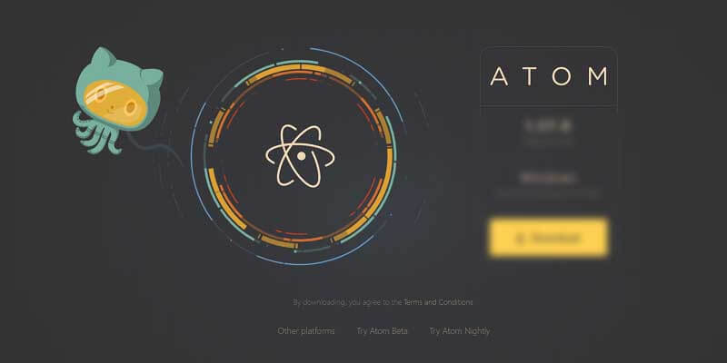
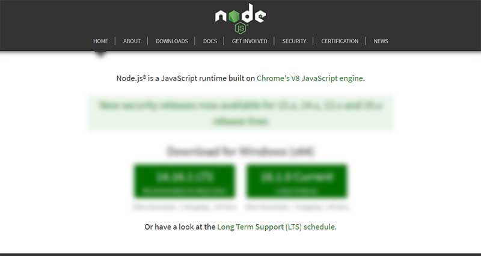
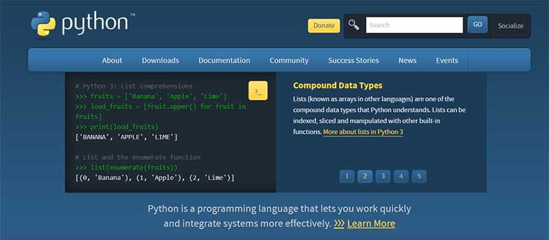
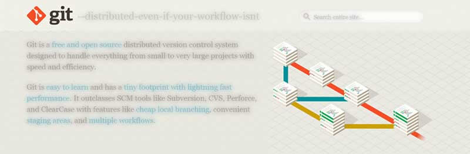
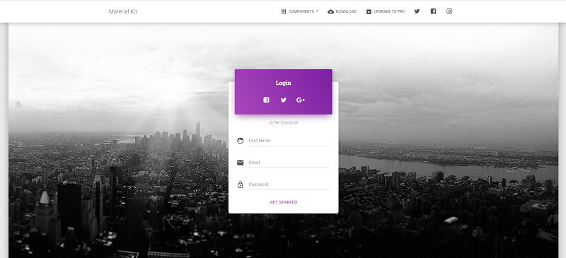

# Minimal Programming Kit

This page aims to help beginners to set up their PC for programming. All recommended tools are free, stable, and widely used even by experienced programmers and designers. In the end, we will build a popular open-source project using the downloaded tools.&#x20;

> The Short-list

* A modern editor - [VSCode](https://code.visualstudio.com) or [Atom](https://atom.io)
* [Nodejs](https://nodejs.org/en/) - used in [Javascript](https://developer.mozilla.org/en-US/docs/Web/JavaScript)-based products and tools
* [Yarn](https://yarnpkg.com) - a popular package manager for NodeJS (better than [NPM](https://www.npmjs.com))
* [Python](https://www.python.org) - a modern script language used for many types of projects&#x20;
* [GIT](https://git-scm.com) - a command-line tool used to download sources from [Github](https://github.com)
* [Gulp](https://gulpjs.com) - a toolkit to automate repetitive tasks&#x20;


> Note: For support regarding this tutorial please access the [AppSeed](https://appseed.us) platform or join the community on [Discord](https://discord.gg/fZC6hup).   &#x20;


### VSCode

We need this software to visualize and edit the sources, execute our projects and investigate the issues that might occur during the programming process.&#x20;

* [VSCode](https://code.visualstudio.com) - official website
* [VSCode](https://code.visualstudio.com/Download) - download page




### Atom

A popular open-source text editor for developers with a modern UI, deeply customizable and fast.&#x20;

**Customization -** It's easy to customize and style Atom. Tweak the look and feel of your UI with CSS/Less, and add major features with HTML and JavaScript.

**Themeable** -  Atom comes pre-installed with four UI and eight syntax [themes](https://atom.io/themes) in both dark and light colors.

**Github-ready** - The GitHub package is already bundled with Atom - Create new branches, stage and commit, push and pull, resolve merge conflicts, view pull requests, and more—all from within your editor.

* [Atom](https://atom.io) - official website
* [Atom](https://github.com/atom/atom) - Github repository  &#x20;



###

### NodeJS

Installing NodeJS unlocks access to a huge ecosystem that exposes many tools and libraries we can use in our projects:

* For coding web pages: [React](https://reactjs.org), [Vue](https://vuejs.org), [Svelte](https://svelte.dev)
* Backend: [Express](https://expressjs.com), [Fastify](https://www.fastify.io), [Koa](https://koajs.com)
* Tools: [Gulp](https://gulpjs.com), [Webpack](https://webpack.js.org)

To get started with Node please access the official website and download a version compatible with your operating system

* &#x20;[NodeJS](https://nodejs.org/en/) - official website
* [NodeJS ](https://nodejs.org/en/download/)- download page



###

### Yarn

Yarn is a package manager that doubles down as project manager. Whether you work on one-shot projects or large monorepos, as a hobbyist or an enterprise user, we've got you covered.

In other words, Yarn is a replacer for `NPM` commands as shown below:

```
$ npm install
// OR
$ yarn
```

> Execution task

```
$ npm run start
// OR 
$ yarn start
```

Yarn uses an optimized workflow for fetching packages by using a local package (when available).  For more information please access the project HOMEpage:

* [Yarn](https://yarnpkg.com) - official website
* [NPM vs Yarn](https://www.geeksforgeeks.org/difference-between-npm-and-yarn/) - a comprehensive comparison&#x20;


### Python&#x20;

[Python](https://www.python.org) is a general-purpose coding language—which means that, unlike HTML, CSS, and JavaScript, it can be used for other types of programming and software development besides web development. Python is interpreted, easy to learn surrounded by a huge ecosystem, actively supported and used in many industries and domains. **Can be used for things like** (starting from the simple ones):&#x20;

* Basic programming: using strings, adding numbers, open files
* Writing system scripts (creating instructions that tell a computer system to “do” something)
* Back end (or server-side) web and mobile app development
* Desktop apps and software development
* Processing big data and performing mathematical computations

**Python** can be downloaded from the [official website](https://www.python.org). Choose the installer for your operating system, download, and click a few times.

```bash
$ python --version
Python 3.7.2 <-- All Good
```




### GIT

Git is a **free and open-source** distributed version control system designed to handle everything from small to very large projects with speed and efficiency. Using GIT we can clone/download and manage projects from Github and BitBucket with ease.&#x20;

* [GIT](https://git-scm.com) - official website
* [GIT](https://git-scm.com/downloads) - download page

To check the installation,  feel free to open a terminal and type  `git --version`:

```
git --version
git version 2.28.0.windows.1 <-- All Good
```




### Build a Sample Project

To make this short tutorial useful, we will build in the local environment a popular open-source project from [Creative-Tim](https://bit.ly/3fKQZaL): [Material Kit](https://bit.ly/3u2lZc6) (free version) with a few commands typed in the terminal.  **Material Kit** is a **Free Bootstrap 4 UI Kit** with a fresh, new design inspired by Google's material design. &#x20;

* [Material Kit](https://bit.ly/3u2lZc6) - product page
* [Material Kit](https://bit.ly/2RMZDO4) - LIVE Demo&#x20;

To build locally this amazing product, we will follow up a simple setup: clone the sources from the public repository (Github), install modules and start the template. Let's go!

**Step #1** - Clone the sources

```bash
$ git clone https://github.com/creativetimofficial/material-kit.git
$ cd material-kit
```

&#x20;**Step #2** - Install project dependencies (this might take a while)

```bash
$ npm install
```

&#x20;**Step #3** - Start the project

```bash
$ npm run start
```

If all goes well, we shoould see Material Kit starter running in the browser:&#x20;



**Links & Resources**

* Free [React Dashboards](https://dev.to/sm0ke/react-dashboards-open-source-apps-1c7j) - a curated list published on Dev.to
* [Open-source Dashboards](https://appseed.us/admin-dashboards/open-source) provided by AppSeed ****&#x20;
