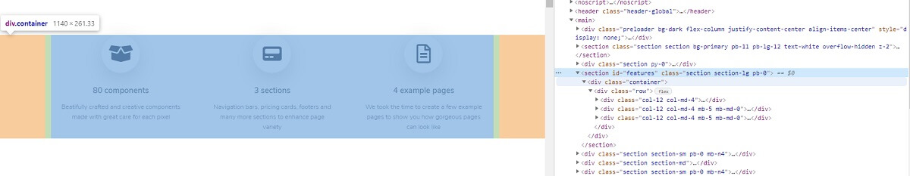
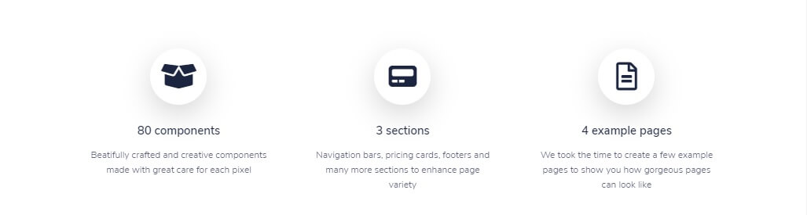

# Parse HTML Components

Parsing HTML and extract the relevant information is something we can use in many contexts: scan a page for a price change, extract a component, detect the broken links .. etc. 

AppSeed, in particular, uses HTML parsing for two things:

* Page structure detection
* Component extraction 

For newcomers, **AppSeed** uses automation tools to convert lifeless UI Kits into simple starters generated in many frameworks and patterns. For instance, this open-source design - **Pixel Lite** provided by Themesberg has been _translated_ to Flask and Django using HTML parsing as the first phase of the translation process. 

> Required libraries and tools

* [Python](https://www.python.org/) - interpreter 
* [Beautiful Soup](https://www.crummy.com/software/BeautifulSoup/bs4/doc/) - a well-known parsing library 
* [Lxml](https://lxml.de/) - used to compensate BS4 limitations 

### The process

The flow explained in this article will execute a few simple steps:

* Load the HTML content - this can be done from a local file or using a LIVE website
* Analyze the page and extract XPATH expression for a component
* Use Lxml library to extract the HTML
* Format the component and save it on disk

> Install libraries via PIP

```text
$ pip install requests 
$ pip install lxml
$ pip install beautifulsoup4
```

From this point, all the code is typed using a python console

```python
$ python [ENTER]
>>>
```

> Load the content from local file

```python
>>> f = open('./app/templates/index.html','r')
>>> html_page = f.read()
```

> Load content from remote HTML file \(the [LIVE sample](https://demo.themesberg.com/pixel-lite/index.html)\)

```python
>>> import requests
>>> page = requests.get('https://demo.themesberg.com/pixel-lite/index.html')
>>> html_page = page.content
```

At this point `html_page` variable contains the entire HTML content \(string type\) and we can use it in BS4 or Lxml to extract the components. To visualize the page structure we can use browser tools: 



The target component will be extracted using an `XPATH` expression provided by the browser:

```markup
//*[@id="features"]
```

To extract the component, this `XPATH` expression will be used in **Lxml** library to isolate the code. 

```python
>>> from lxml import html
>>> html_dom = html.fromstring( html_page )
>>> component = html_dom.xpath( '//*[@id="features"]' )
  
```

To extract the raw HTML from the `component` object we need to use `tostring` helper exposed by Lxml library:

```python
>>> from lxml.etree import tostring
>>> component_html = tostring( component[0] )
```

The next step is to call Beautiful soup and prettify the HML for saving on disk

```python
>>> from bs4 import BeautifulSoup as bs
>>> soup = bs( component_html )
>>> soup.prettify()
```

The component is fully extracted and parsable:

```markup
  <section class="section section-lg pb-0" id="features">
   <div class="container">
    <div class="row">
     
     ...
     
     <div class="col-12 col-md-4">
      <div class="icon-box text-center mb-5 mb-md-0">
       <div class="icon icon-shape icon-lg bg-white shadow-lg border-light rounded-circle icon-secondary mb-3">
        <span class="fas fa-box-open">
        </span>
       </div>
       <h2 class="my-3 h5">
        80 components
       </h2>
       <p class="px-lg-4">
        Beatifully crafted and creative components made with great care for each pixel
       </p>
      </div>
     </div>
     
     ...
     
     </div>
    </div>
   </div>
  </section>
```

> The rendered version:



