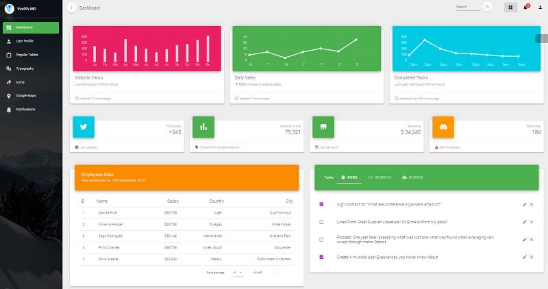

# Vuetify Material Dashboard

Vuetify Material Dashboard is a beautiful resource built over [Vuetify](https://vuetifyjs.com/en/), [Vuex](https://vuex.vuejs.org/) and [Vuejs](https://vuejs.org/v2/guide/). It will help you get started developing dashboards in no time. Using the Dashboard is pretty simple but requires basic knowledge of Javascript, [Vuejs](https://vuejs.org/v2/guide/) and [Vue Router](https://router.vuejs.org/en/).

* [Vuetify Material Dashboard](https://bit.ly/39TwqHU) - product page hosted by Creative-Tim
* [Vuetify Material Dashboard](https://bit.ly/33ssGZQ) - LIVE deployment 

Vuetify is developed exactly according to Material Design spec. Every component is handcrafted to bring you the best possible UI tools to your next great app. The development doesn't stop at the core components outlined in Google's spec. Through the support of community members and sponsors, additional components will be designed and made available for everyone to enjoy.

