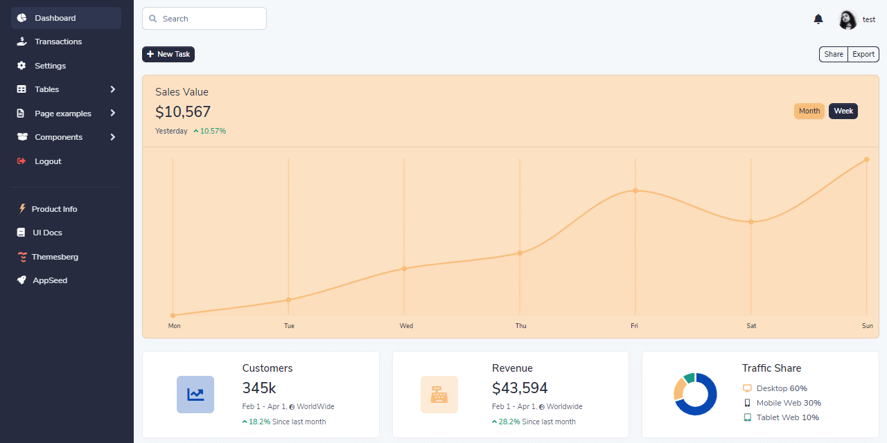

# What IS  Boilerplate Code

In programming, boilerplate code is a piece of software that can be reused without changing much. The whole idea behind a starter \(sometimes boilerplate code\) is to skip coding that piece of code common to many projects.

* [Boilerplate Code](https://en.wikipedia.org/wiki/Boilerplate_code) - Wikipedia page
* [Boilerplate Code](https://appseed.us/boilerplate-code) - page hosted by AppSeed

AppSeed workflow uses boilerplate code to generate usable, production-ready starters.

> Boilerplate code provided and actively supported by AppSeed:

* [Flask Dashboard Starter](https://github.com/app-generator/boilerplate-code-flask-dashboard) - database, ORM, Blueprints, and deployment scripts
* [Django Dashboard Starter](https://github.com/app-generator/boilerplate-code-django-dashboard) - SQLite, Session-based Authentication, Deploy
* [Boilerplate Code 11ty](https://github.com/app-generator/boilerplate-code-11ty) - Eleventy Seed project

### Sample Project

Volt Dashboard Django - open-source dashboard generated by AppSeed in [**Django**](https://appseed.us/admin-dashboards/django) Framework. Volt Dashboard is a free and open source [**Bootstrap 5**](https://appseed.us/admin-dashboards/django-dashboard-volt) Admin Dashboard featuring over 100 components, 11 example pages and 3 plugins with Vanilla JS. There are more than 100 free Bootstrap 5 components included some of them being buttons, alerts, modals, datepickers, etc.

* [Django Bootstrap 5 Volt](https://appseed.us/admin-dashboards/django-dashboard-volt) - product page
* [Django Bootstrap 5 Volt - Demo](https://django-volt-dashboard.appseed-srv1.com/) - LIVE deployment

