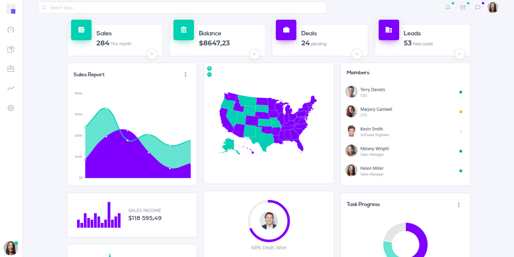

# Bulma Css

A [CSS framework](https://en.wikipedia.org/wiki/CSS_framework) is a software framework that is meant to allow for easier, more standards-compliant web design using the Cascading Style Sheets language. Basically, a CSS Framework helps developers to craft much faster their apps. Well, Bulma is not an exception to this rule.

* [Bulma CSS](https://bulma.io/) - the official website
* [Bulma Docs](https://bulma.io/documentation/) - the official documentation

**Bulma** is very easy to learn and set up. It is built with SASS and divided by 39 .sass files. Code can be customized easily by dividing into separate files and it allows customizing the part of the application to get the expected result. The modular design helps to build lightweight apps by importing only what you're using in the specific parts of the software - Features:

* It is a lightweight, modern CSS framework, which uses Flexbox.
* Mobile-first architecture
* Easy to customize via SaaS files
* Pure CSS, no Javascript plugins included.

## Sample Projects

* [BulmaPlay](https://appseed.us/apps/bulma-css/bulmaplay) - open-source seed project that uses Bulma as CSS framework
* [BulmaLanding](https://appseed.us/apps/bulma-css/bulmalanding) - one-page project built with Bulma
* [Flask Dashkit PRO](https://appseed.us/admin-dashboards/flask-dashboard-dashkit-pro) - premium starter styled with Bulma Css

Dashkit comes bundled with Bulkit as a dashboard starter kit. It offers some original styles and also a catchy user profile. The design has been thought to give the best possible experience either on mobile and on desktop. Dashkit uses the Bulkit theming system, so you can change all colors in a breeze. Dashkit also uses some of Bulkit components.

* [Bulma CSS Dashkit Flask](https://appseed.us/admin-dashboards/flask-dashboard-dashkit-pro) - Product page
* [Bulma CSS Dashkit Flask - Demo](https://flask-dashboard-dashkit-pro.appseed.us/) - LIVE App

