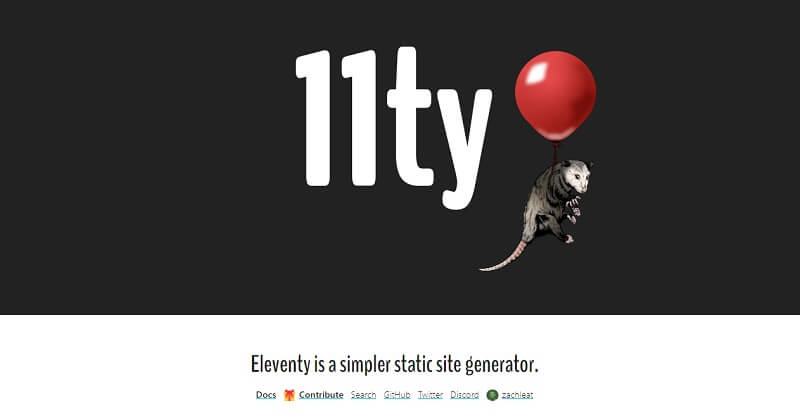

# What IS Eleventy

Eleventy (11ty) was created to be a JavaScript alternative to Jekyll. It’s zero-config by default but has flexible configuration options. Eleventy works with your project’s existing directory structure.

Unlike other JavaScript web frameworks like Gatsby or NuxtJS, 11ty doesn’t come bundled with a front-end library. 11ty is more like a traditional SSG (such as Hugo or Jekyll) where it takes a series of templates, markdown files, and data and renders HTML files to serve.

* [Eleventy (11ty)](https://www.11ty.dev) - official website&#x20;

Eleventy uses independent template engines. We don’t want to hold your content hostage. If you decide to use something else later, having your content decoupled in this way will make migration easier. Eleventy works with multiple template languages. You can pick one or use them all together in a single project: `html`, `Markdown`, `Liquid`, `Mustache`.



### Reasons to use 11ty&#x20;

Eleventy is a static site generator created for three main reasons (according to the creator, Zach Leaterman).

> **Flexibility**&#x20;

Eleventy allows you to mix and match templating engines to allow easy migration of existing content. Your content templates can use a different templating engine than your layout files!

Previous SSG's are tied to a single template language, as a rule. Jekyll uses Liquid, Hugo uses Go Templates and Gatsby is React entirely. Eleventy innovates and empower the developer to use his preferred language from a long list:

* HTML
* Markdown
* Liquid (used by Jekyll)
* Nunjucks
* Handlebars
* Mustache
* EJS
* Haml
* Pug

> **Directory structure flexibility**

Eleventy wants to work with your project’s existing directory structure. Is not mandatory to save your content files in a `_posts` directory or a source folder (unless you really want to). You tell Eleventy where your files are and we’ll work with you. This is pretty nice!

All you need to do is to execute `eleventy` and all files from the current directory are translated to `_site` folder. This can be customized with ease using `--input` and `--output` arguments.

> **Eleventy is Javascript**

JavaScript gives you access to npm, a massive ecosystem with many modules and libraries built by open-source enthusiasts. While Eleventy uses JavaScript in node.js to transform templates into content, importantly (by default) it does not recommend nor force your HTML to include any Eleventy-specific client-side JavaScript.


### Install Eleventy

Ready to start? You're one line away:

```bash
$ npm install -g @11ty/eleventy # global installation
```
