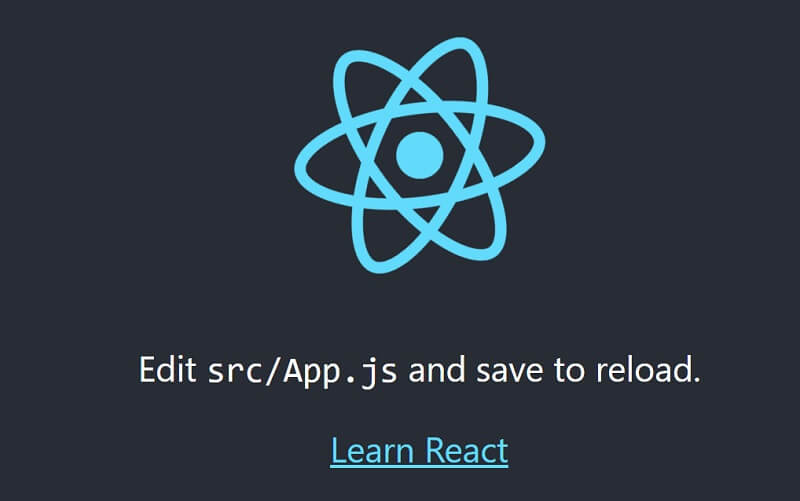

# What IS React

React is an **open-source** front-end JavaScript library for building user interfaces or UI components. It is maintained by Facebook and a community of individual developers and companies. React can be used as a base in the development of single-page or mobile applications.

* [React JS](https://reactjs.org) - official website
* [React JS](https://reactjs.org/docs/getting-started.html) - documentation


As mentioned in the official documentation, the easiest way to start using React is to write the code directly in your HTML files. Start by including three scripts, the first two let us write React code in our JavaScripts, and the third, Babel, allows us to write JSX syntax and ES6 in older browsers.

> Here is a Hello World in React

```javascript
<!DOCTYPE html>
<html>
  <script src="https://unpkg.com/react@16/umd/react.production.min.js"></script>
  <script src="https://unpkg.com/react-dom@16/umd/react-dom.production.min.js"></script>
  <script src="https://unpkg.com/babel-standalone@6.15.0/babel.min.js"></script>
  <body>
  
    <div id="app"></div>

    <script type="text/babel">
      class Hello extends React.Component {
        render() {
          return <h1>Hello React!</h1>
        }
      }

      ReactDOM.render(<Hello />, document.getElementById('app'))
    </script>
  </body>
</html>
```

###

### Environment

To properly run a React project the workstation needs a [minimal programming kit](../tutorials/minimal-programming-kit.md) properly installed and accessible in the terminal. 

* [Node JS](https://nodejs.org/en/) - the ecosystem used by the React Library
* A modern code editor like [VsCode](https://code.visualstudio.com) or [Atom](https://atom.io)
* [NPM](https://www.npmjs.com) - a package manager for Javascript
* (optional) [Yarn](https://yarnpkg.com) - a faster alternative to NPM

Also, the ability to work in the terminal and call system commands might speed up the development process. Once we have the NodeJS installed, we should install the `create-react-app` command-line tool in the global scope.

  **Step #1 **- Install `create-react-app` (CRA) tool 

```bash
$ npm install -g create-react-app
```

  **Step #2 **- Create the React app skeleton

```bash
$ npx create-react-app reactapp
```

This command will create a new directory `reactapp` equipped with scripts and basic structure for a React project. 

**Step #3** - Install dependencies

```
$ cd reactapp
$ npm i 
// OR 
$ yarn
```

**Step #4** - Start the project (development mode)

```bash
$ npm run start
// OR 
$ yarn start 
```

The output should be similar to this:

```bash
Compiled successfully!
You can now view reactapp in the browser.

  Local:            http://localhost:3000
  On Your Network:  http://172.22.160.1:3000

Note that the development build is not optimized.
To create a production build, use yarn build. 
```

CRA tool will open automatically the browser window with the React default page. 



For more than a simple React app or template, AppSeed provided a generous index with full-stack starters built in React and powered by different technologies in the backend: 

* [React Node JS Berry](https://appseed.us/product/react-node-js-berry-dashboard)** - **a Material-UI dashboard combined with an Express Backend 
* [Django React Datta Able](https://appseed.us/product/django-react-datta-able)** **- open-source product bundled with Django
* [Full-Stack React Berry PRO](https://appseed.us/full-stack/react-berry-dashboard) - premium dashboard bundled with multiple API Servers


