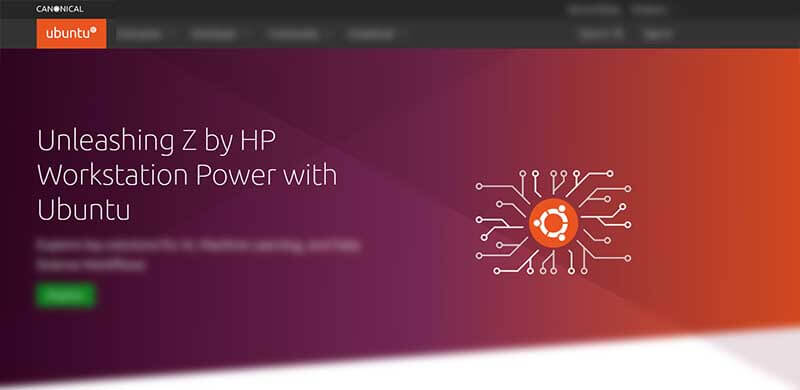

# What IS Ubuntu

**Ubuntu** is a free and open-source Linux distribution based on Debian. Ubuntu is officially released in three editions: Desktop, Server, and Core for the internet of things devices and robots. All the editions can run on the computer alone, or in a virtual machine.

* [Ubuntu](https://ubuntu.com) - official website
* [Ubuntu](https://ubuntu.com/download/desktop) - Downloads page

&#x20;

### Ubuntu Information

**Ubuntu** is a complete Linux operating system, freely available with both community and professional support.

* Ubuntu will always be free of charge, and there is no extra fee for the “enterprise edition”, we make our very best work available to everyone on the same Free terms.
* Ubuntu includes the very best in translations and accessibility infrastructure that the Free Software community has to offer, to make Ubuntu usable by as many people as possible.
* Ubuntu is entirely committed to the principles of open-source software development; we encourage people to use open source software, improve it and pass it on.

Ubuntu includes thousands of pieces of software, starting with the Linux kernel version 4.15 and GNOME 3.28, and covering every standard desktop application from word processing and spreadsheet applications to internet access applications, web server software, email software, programming languages and tools, and of course several games.

###

### Ubuntu Resources

* [Ubuntu](https://ubuntu.com) - official website
* [Canonical](http://www.canonical.com) - The official sponsor
