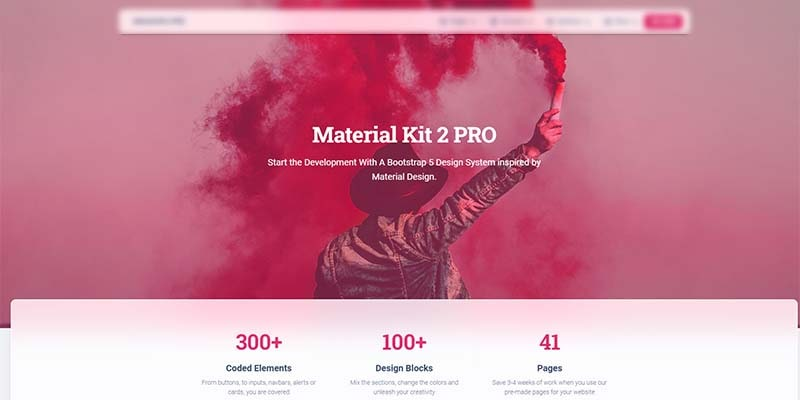

# Django Material Kit 2 PRO

****[**Material Kit 2**](https://appseed.us/product/django-material-kit2-pro) is a premium design crafted by `Creative-Tim` agency on top of Bootstrap 5 Framework. Designed for those who like bold elements and beautiful websites, `Material Kit 2` is made of hundred of elements, designed blocks, and fully coded pages built with an impressive level of quality. The **Flask** codebase provides bare minimum essential features that help you to start faster a new project. &#x20;

> Features&#x20;

* `Up-to-date dependencies`: **Django 3.2.6 LTS**
* SCSS compilation via **Gulp**
* UI Kit: **Material Kit - v3.0.0** (Bootstrap 5 Version) by **Creative-Tim**
* `SQLite` Database, Django Native ORM
* Modular design, clean code-base
* Session-Based Authentication, Forms validation
* `Deployment`: **Docker**, Gunicorn / Nginx&#x20;

> Links&#x20;

* 👉 [Django Material Kit2 PRO](https://appseed.us/product/django-material-kit2-pro) - product page
* 👉 [Django Material Kit2 PRO](https://django-material-kit2-pro.appseed-srv1.com) - LIVE Demo
* 👉 [Material Kit 2 PRO](https://www.creative-tim.com/learning-lab/bootstrap/overview/material-kit?AFFILIATE=128200) - UI Docs&#x20;

### ✨ What is Django

**Django** is a high-level Python Web framework that encourages rapid development and clean, pragmatic design. Built by experienced developers, it takes care of much of the hassle of Web development, so you can focus on writing your app without needing to reinvent the wheel. It’s free and open source.

> Read more about [Django Framework](../../content/what-is/django.md)

### ✨ How to use the App

* [Set up the environment](../../boilerplate-code/django.md#environment) - prepare your workstation for **Django**
* [Compile the sources](../../boilerplate-code/django.md#build-the-app) - start this **Django** app in the local environment
* [App Codebase](../../boilerplate-code/django-dashboard.md#app-codebase) - how the project files are organized
* [App Configuration](../../boilerplate-code/django-dashboard.md#app-configuration) - how to configure this **Django** application

### ✨ Material Kit 2 PRO

**Material Kit 2 PRO** is built with over 300 frontend individual elements, like buttons, inputs, navbars, nav tabs, cards, or alerts, giving you the freedom of choosing and combining. All components can take variations in color, which you can easily modify using SASS files and classes.

* [Material Kit 2 PRO](https://www.creative-tim.com/product/material-kit-pro?AFFILIATE=128200) - BS5 version (product page)
* [Material Kit 2 PRO](https://www.creative-tim.com/learning-lab/bootstrap/overview/material-kit?AFFILIATE=128200) - UI Documentation&#x20;

