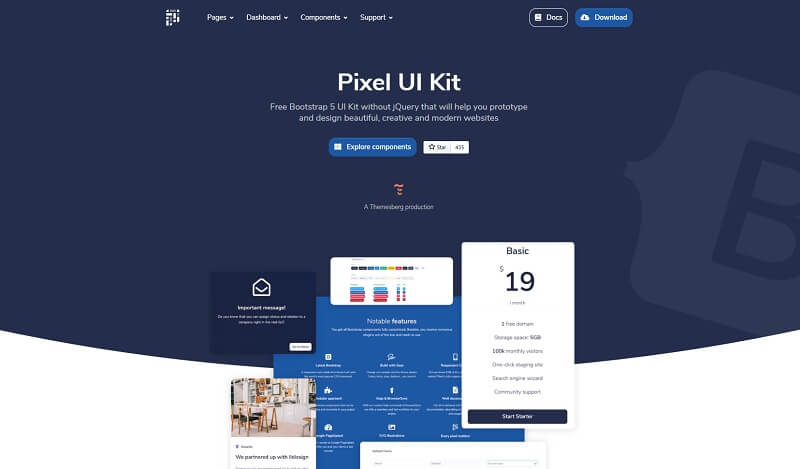

# Django Pixel Lite

Pixel is a free, fully responsive, and modern **Bootstrap 5 UI Kit** that will help you build creative and professional websites. Use our components and sections, switch some Sass variables to build and arrange pages to best suit your needs. The **Django codebase** is provided with database, ORM, authentication, and deployment scripts. &#x20;

> Features&#x20;

* SQLite Database, Django Native ORM
* Session-Based Authentication, Forms validation
* Deployment scripts: Docker, Gunicorn/Nginx

> Links

* [Django Pixel Lite](https://appseed.us/django/django-pixel-bootstrap-uikit) - product page
* [Django Pixel Lite](https://github.com/app-generator/django-pixel-bootstrap-uikit) - source code&#x20;
* [Django Pixel Lite](https://django-pixel-lite.appseed-srv1.com) - LIVE Demo

> [Support](https://appseed.us/support) (Email and LIVE on Discord) for **registered** [**AppSeed**](https://appseed.us) **users**.

### What is Django

Django is a high-level Python Web framework that encourages rapid development and clean, pragmatic design. Built by experienced developers, it takes care of much of the hassle of Web development, so you can focus on writing your app without needing to reinvent the wheel. It’s free and open source.

> Read more about [Django Framework](../../content/what-is/django.md)

### How to use the App

* [Set up the environment](../../boilerplate-code/django.md#environment) - prepare your workstation for **Django**
* [Compile the sources](../../boilerplate-code/django.md#build-the-app) - start this **Django** app in the local environment
* [App Codebase](../../boilerplate-code/django-dashboard.md#app-codebase) - how the project files are organized
* [App Configuration](../../boilerplate-code/django-dashboard.md#app-configuration) - how to configure this **Django** application

### Pixel Lite UI Kit

Pixel is a premium extension of the famous Bootstrap CSS Framework featuring pricing cards, profile cards, timelines, and many more. All components are created to comply as much as possible with the WCAG 2.1 standards.

* [Pixel Lite](../../content/bootstrap-template/pixel-lite-template.md) - information provided by AppSeed
* [Pixel Lite](https://themesberg.com/product/ui-kit/pixel-free-bootstrap-5-ui-kit) - product page hosted by [Themesberg](../../content/partners/themesberg.md)

