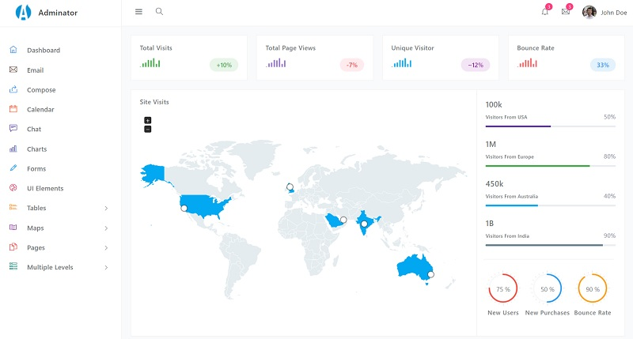

# Django Adminator

**Adminator** is a responsive Bootstrap 4 Admin Template. It provides you with a collection of _ready-to-use_ code snippets and utilities, custom pages, a collection of applications, and some useful widgets. 

> Features

* Codebase - [Django Dashboard Boilerplate](../../boilerplate-code/django-dashboard.md)
* UI Kit: **Adminator** crafted by ColorLib
* SQLite Database, Django Native ORM
* Session-Based Authentication, Forms validation
* Deployment scripts: Docker, Gunicorn/Nginx 

> Links

* [Adminator Django](https://appseed.us/admin-dashboards/django-dashboard-adminator) - product page
* [Adminator Django](https://github.com/app-generator/django-dashboard-adminator) - source code
* [Adminator Django](https://django-adminator.appseed-srv1.com/) - LIVE Demo
* [Support](https://appseed.us/support):  via **Github** \(issues tracker\) and [Discord](https://discord.gg/fZC6hup) - 24/7 LIVE Assistance. 

### What is Django

Django is a high-level Python Web framework that encourages rapid development and clean, pragmatic design. Built by experienced developers, it takes care of much of the hassle of Web development, so you can focus on writing your app without needing to reinvent the wheel. It’s free and open source.

> Read more about [Django Framework](../../content/what-is/django.md)

### How to use the App

* [Set up the environment](../../boilerplate-code/django-dashboard.md#environment-1) - prepare your workstation for **Django**
* [Compile the sources](../../boilerplate-code/django-dashboard.md#build-the-app-1) - start this **Django** app in the local environment
* [App Codebase](../../boilerplate-code/django-dashboard.md#app-codebase) - how the project files are organized
* [App Configuration](../../boilerplate-code/django-dashboard.md#app-configuration) - how to configure this **Django** application

### Adminator UI Kit

**Adminator** is a popular open-source template for admin dashboards and control panels. It is a responsive HTML template that is based on the Bootstrap CSS framework. For newcomers, [Adminator](https://appseed.us/admin-dashboards/django-dashboard-adminator) is provided by ColorLib, a well-known company involved in many ope-source products. **Adminator** has a modern UI and comes with a _state-of-the-art_ tooling chain to compile the HTML files.

* [Adminator](../../content/bootstrap-template/adminator.md) - more information provided by AppSeed
* [Adminator](https://github.com/puikinsh/Adminator-admin-dashboard) - source code \(HTML version\)

