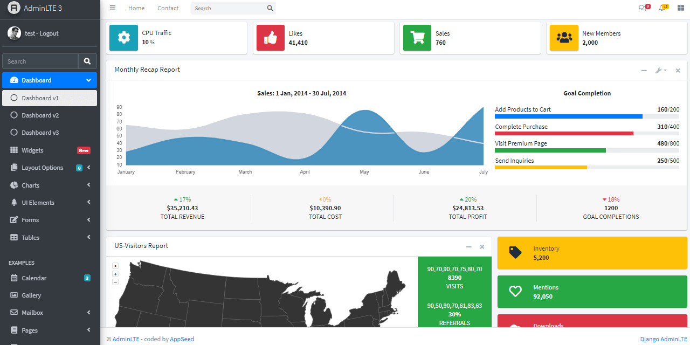

# AdminLTE Django

One of the best open-source admin dashboard & control panel theme. Built on top of Bootstrap, AdminLTE provides a range of responsive, reusable, and commonly used components.

> Features

* Codebase - [Django Dashboard Boilerplate](../../boilerplate-code/django-dashboard.md)
* UI Kit: **AdminLTE**
* SQLite Database, Django Native ORM
* Session-Based Authentication, Forms validation
* Deployment scripts: Docker, Gunicorn/Nginx 

> Links

* [AdminLTE Django](https://appseed.us/admin-dashboards/django-dashboard-adminlte) - product page
* [AdminLTE Django](https://github.com/app-generator/django-dashboard-adminlte) - source code
* [AdminLTE Django](https://adminlte-django.appseed-srv1.com/) - LIVE Demo
* [Support](https://appseed.us/support):  via **Github** \(issues tracker\) and [Discord](https://discord.gg/fZC6hup) - 24/7 LIVE Assistance. 

### How to use the App

* [Set up the environment](../../boilerplate-code/django-dashboard.md#environment-1) - prepare your workstation
* [Compile the sources](../../boilerplate-code/django-dashboard.md#build-the-app-1) - start the app in the local environment
* [App Codebase](../../boilerplate-code/django-dashboard.md#app-codebase) - how the files are organized
* [App Configuration](../../boilerplate-code/django-dashboard.md#app-configuration) - how to configure the application

### AdminLTE - UI Kit

**AdminLTE** is a popular open-source template for admin dashboards and control panels. It is a responsive HTML template that is based on the Bootstrap CSS framework. It utilizes all of the Bootstrap components in its design and re-styles many commonly used plugins to create a consistent design that can be used as a user interface for backend applications. AdminLTE is based on a modular design, which allows it to be easily customized and built upon.

* [AdminLTE](https://adminlte.io/) - product page \(HTML version\)

