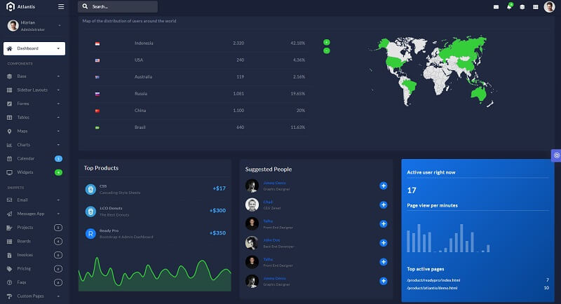

# Django Atlantis Dark PRO

Atlantis is a beautiful and elegant Bootstrap 4 admin dashboard designed to manage and visualize data about your business. Every element has multiple states for colors, styles, hover, focus, that you can easily access and use.  

> Features

* Codebase - [Django Dashboard Boilerplate](../../boilerplate-code/django-dashboard.md)
* UI Kit: [Atlantis Dark PRO](../../content/bootstrap-template/atlantis-pro.md) crafted by ThemeKita 
* SQLite Database, Django Native ORM
* Session-Based Authentication, Forms validation
* Deployment scripts: Docker, Gunicorn/Nginx 

> Links

* [Atlantis Dark PRO Django](https://appseed.us/admin-dashboards/django-dashboard-atlantis-dark-pro) - product page
* [Atlantis Dark PRO Django](https://github.com/app-generator/django-atlantis-dark-pro) - public repository used for tracking issues 
* [Atlantis Dark PRO Django](https://django-atlantis-dark-pro.appseed-srv1.com/) - LIVE Demo
* [Support](https://appseed.us/support):  via **Github** \(issues tracker\) and [Discord](https://discord.gg/fZC6hup) - 24/7 LIVE Assistance. 

### 

### What is Django

Django is a high-level Python Web framework that encourages rapid development and clean, pragmatic design. Built by experienced developers, it takes care of much of the hassle of Web development, so you can focus on writing your app without needing to reinvent the wheel. It’s free and open source.

> Read more about [Django Framework](../../content/what-is/django.md)

### How to use the App

* [Set up the environment](../../boilerplate-code/django-dashboard.md#environment-1) - prepare your workstation for **Django**
* [Compile the sources](../../boilerplate-code/django-dashboard.md#build-the-app-1) - start this **Django** app in the local environment
* [App Codebase](../../boilerplate-code/django-dashboard.md#app-codebase) - how the project files are organized
* [App Configuration](../../boilerplate-code/django-dashboard.md#app-configuration) - how to configure this **Django** application

### [Atlantis Dark PRO](../../content/bootstrap-template/atlantis-pro.md) - UI Kit

Atlantis PRO has 9 layouts, 26 plugins and many UI components to help developers create dashboards quickly and effectively so they can save development time and also help users to make the right and fast decisions based on existing data.

* [Atlantis Dark PRO](../../content/bootstrap-template/atlantis-pro.md) - information provided by AppSeed

