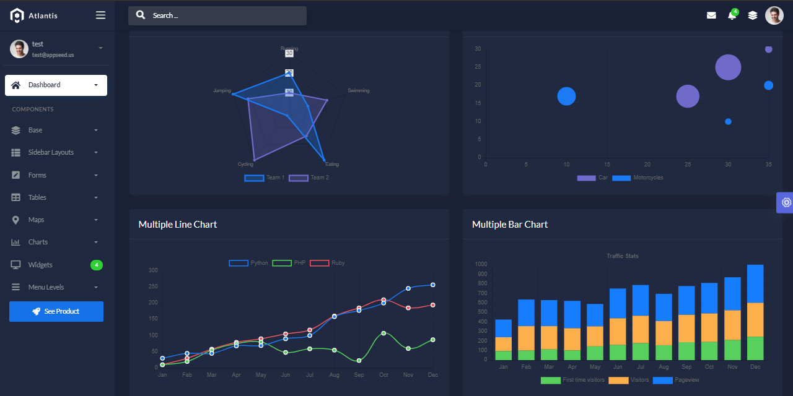

# Django Atlantis Dark

**Atlantis Dark Lite** is a free bootstrap 4 admin dashboard that is beautifully and elegantly designed to display various metrics, numbers, or data visualization.  

> Features

* Codebase - [Django Dashboard Boilerplate](../../boilerplate-code/django-dashboard.md)
* UI Kit: **Atlantis Dark** design \(free version\)
* SQLite Database, Django Native ORM
* Session-Based Authentication, Forms validation
* Deployment scripts: Docker, Gunicorn/Nginx 

> Links

* [Atlantis Dark Django](https://appseed.us/admin-dashboards/django-dashboard-atlantis-dark) - product page
* [Atlantis Dark Django](https://github.com/app-generator/django-dashboard-atlantis-dark) - source code 
* [Atlantis Dark Django](https://django-atlantis-dark.appseed-srv1.com/) - LIVE Demo
* [Support](https://appseed.us/support):  via **Github** \(issues tracker\) and [Discord](https://discord.gg/fZC6hup) - 24/7 LIVE Assistance. 

### How to use the App

* [Set up the environment](../../boilerplate-code/django-dashboard.md#environment-1) - prepare your workstation
* [Compile the sources](../../boilerplate-code/django-dashboard.md#build-the-app-1) - start the app in the local environment
* [App Codebase](../../boilerplate-code/django-dashboard.md#app-codebase) - how the files are organized
* [App Configuration](../../boilerplate-code/django-dashboard.md#app-configuration) - how to configure the application

### Atlantis Lite - UI Kit

Atlantis Dark Lite admin dashboard has 2 layouts, many plugins, and UI components to help developers create dashboards quickly and effectively so they can save development time and also help users to make the right and fast decisions based on existing data.

* [Atlantis Lite](https://www.themekita.com/atlantis-lite-bootstrap-dashboard.html) - product page \(HTML version\)
* [Atlantis Lite](https://themekita.com/demo-atlantis-bootstrap/livepreview/documentation/) - documentation 

