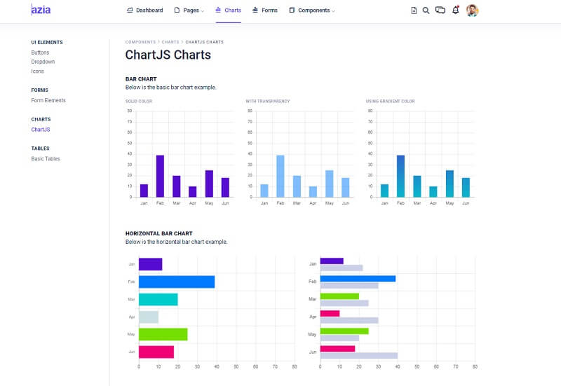

# Django Azia Dashboard

**Azia Dashboard** is a beautifully designed admin template featuring a fine selection of useful Bootstrap components and elements. The pre-built pages of the templates are intuitive and very well-designed. 

> Features

* Codebase - [Django Dashboard Boilerplate](../../boilerplate-code/django-dashboard.md)
* UI Kit: Azia Dashboard (free version)  
* SQLite Database, Django Native ORM
* Session-Based Authentication, Forms validation
* Deployment scripts: Docker, Gunicorn/Nginx 

> Links

* [Azia Dashboard Django](https://github.com/app-generator/django-dashboard-azia) - source code
* [Azia Dashboard Django](https://django-dashboard-azia.appseed-srv1.com) - LIVE Demo 

> [Support](https://appseed.us/support) (Email and LIVE on Discord) for **registered** [**AppSeed**](https://appseed.us) **users**.

###

### What is Django

Django is a high-level Python Web framework that encourages rapid development and clean, pragmatic design. Built by experienced developers, it takes care of much of the hassle of Web development, so you can focus on writing your app without needing to reinvent the wheel. It’s free and open source.

> Read more about [Django Framework](../../content/what-is/django.md)

### How to use the App

* [Set up the environment](../../boilerplate-code/django-dashboard.md#environment-1) - prepare your workstation for **Django**
* [Compile the sources](../../boilerplate-code/django-dashboard.md#build-the-app-1) - start this **Django** app in the local environment
* [App Codebase](../../boilerplate-code/django-dashboard.md#app-codebase) - how the project files are organized
* [App Configuration](../../boilerplate-code/django-dashboard.md#app-configuration) - how to configure this **Django** application

### Azia Dashboard - UI Kit

**Azia** features many essential utility classes that can help cut down CSS bloat and modify CSS components instantly. The pre-built pages of the templates are intuitive and very well-designed.

* [Azia Dashboard](https://bit.ly/3m10jIM) - product page hosted by BootstrapDash

