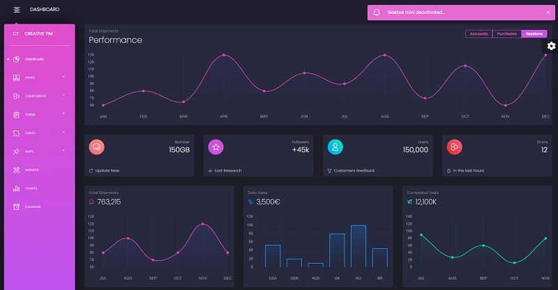

# [Black PRO Django](https://appseed.us/product/black-dashboard-pro/django/)

**Black Dashboard PRO** is a beautiful Bootstrap 4 Admin Dashboard that comes in 2 versions: Dark and Light Mode. If you are looking for a tool to manage and visualize data about your business, this dashboard is the thing for you. It combines colors that are easy on the eye, spacious cards, beautiful typography, and graphics. 

> Features

* Codebase - [Django Dashboard Boilerplate](../../boilerplate-code/django-dashboard.md)
* UI Kit: **Black Dashboard PRO** (premium version)  
* SQLite Database, Django Native ORM
* Session-Based Authentication, Forms validation
* Deployment scripts: Docker, Gunicorn/Nginx 

## [Black Friday](https://appseed.us/discounts/) - `75%OFF`

> The [campaign](https://appseed.us/discounts/)  is active until `30.NOV` and applies to all products and licenses.

<figure><figcaption>
Black Friday - 75%OFF 
</figcaption></figure>

## What is Django

Django is a high-level Python Web framework that encourages rapid development and clean, pragmatic design. Built by experienced developers, it takes care of much of the hassle of Web development, so you can focus on writing your app without needing to reinvent the wheel. It’s free and open source.

> Read more about [Django Framework](../../content/what-is/django.md)

## How to use the App

* [Set up the environment](../../boilerplate-code/django-dashboard.md#environment-1) - prepare your workstation for **Django**
* [Compile the sources](../../boilerplate-code/django-dashboard.md#build-the-app-1) - start this **Django** app in the local environment
* [App Codebase](../../boilerplate-code/django-dashboard.md#app-codebase) - how the project files are organized
* [App Configuration](../../boilerplate-code/django-dashboard.md#app-configuration) - how to configure this **Django** application

### Black Dashboard PRO - UI Kit

**Black Dashboard PRO** features over 200 individual components, like buttons, inputs, cards, tabs, navigations etc., giving you the freedom of choosing and combining. You will save a lot of time going from prototyping to full-functional code because all elements are implemented. We wanted the design process to be seamless, so switching from image to the real page is very easy to do.

* [Black Dashboard PRO](../../content/bootstrap-template/black-dashboard-pro.md) - more information provided by AppSeed&#x20;
* [Black Dashboard](https://bit.ly/2L0W6Z7) (free version) - product page hosted by [Creative-Tim](../../content/partners/creative-tim.md)

