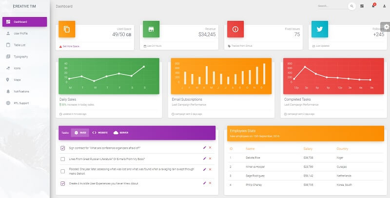

# Django Material Dashboard

**Material Dashboard** is a free Material Bootstrap 4 Admin with a fresh, new design inspired by Google's Material Design. Material Dashboard comes with 5 color filter choices for both the sidebar and the card headers \(blue, green, orange, red, and purple\) and an option to have a background image on the sidebar. 

> Features

* Codebase - [Django Dashboard Boilerplate](../../boilerplate-code/django-dashboard.md)
* UI Kit: [Material Dashboard](../../content/bootstrap-template/material-dashboard.md) \(free version\) 
* SQLite Database, Django Native ORM
* Session-Based Authentication, Forms validation
* Deployment scripts: Docker, Gunicorn/Nginx 

> Links

* [Material Dashboard Django](https://appseed.us/admin-dashboards/django-dashboard-material) - product page
* [Material Dashboard Django](https://github.com/app-generator/django-dashboard-material) - source code 
* [Material Dashboard Django](https://django-material-dashboard.appseed-srv1.com/) - LIVE Demo 

> [Support](https://appseed.us/support) \(Email and LIVE on Discord\) for **registered** [**AppSeed**](https://appseed.us/) **users**.

### What is Django

Django is a high-level Python Web framework that encourages rapid development and clean, pragmatic design. Built by experienced developers, it takes care of much of the hassle of Web development, so you can focus on writing your app without needing to reinvent the wheel. It’s free and open source.

> Read more about [Django Framework](../../content/what-is/django.md)

### How to use the App

* [Set up the environment](../../boilerplate-code/django-dashboard.md#environment-1) - prepare your workstation for **Django**
* [Compile the sources](../../boilerplate-code/django-dashboard.md#build-the-app-1) - start this **Django** app in the local environment
* [App Codebase](../../boilerplate-code/django-dashboard.md#app-codebase) - how the project files are organized
* [App Configuration](../../boilerplate-code/django-dashboard.md#app-configuration) - how to configure this **Django** application

### [**Material Dashboard**](../../content/bootstrap-template/material-dashboard.md) **- UI Kit**

Material Dashboard is a free Material Bootstrap 4 Admin with a fresh, new design inspired by Google's Material Design. We are very excited to introduce our take on the material concepts through an easy-to-use and beautiful set of components. Material Dashboard was built over the popular Bootstrap 4 framework and it comes with a couple of third-party plugins redesigned to fit in with the rest of the elements.

* [Material Dashboard](../../content/bootstrap-template/material-dashboard.md) - information provided by AppSeed 
* [Material Dashboard](https://bit.ly/3fSPqaK) - product page hosted by [Creative-Tim](../../content/partners/creative-tim.md)

