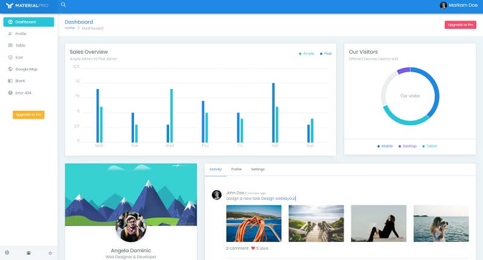

# [MaterialPro Lite Django](https://appseed.us/product/material-wpx/django/) 

WrapPixel's **MaterialPro Bootstrap Lite** is a modern Bootstrap template inspired by Google Material design principles integrated with the essential Bootstrap components and UI elements. &#x20;

> Features

* Codebase - [Django Dashboard Boilerplate](../../boilerplate-code/django-dashboard.md)
* UI Kit: [MaterialPro Lite](../../content/bootstrap-template/materialpro-lite.md) (free version)&#x20;
* SQLite Database, Django Native ORM
* Session-Based Authentication, Forms validation
* Deployment scripts: Docker, Gunicorn/Nginx&#x20;

> Links

* [MaterialPro Lite Django](https://appseed.us/product/material-wpx/django/) - product page
* [MaterialPro Lite Django](https://github.com/app-generator/django-dashboard-material-lite) - source code&#x20;
* [MaterialPro Lite Django](https://django-dashboard-material-lite.appseed.us/) - LIVE Demo&#x20;

> [Support](https://appseed.us/support) (Email and LIVE on Discord) for **registered** [**AppSeed**](https://appseed.us/) **users**.

### What is Django

Django is a high-level Python Web framework that encourages rapid development and clean, pragmatic design. Built by experienced developers, it takes care of much of the hassle of Web development, so you can focus on writing your app without needing to reinvent the wheel. It’s free and open source.

> Read more about [Django Framework](../../content/what-is/django.md)

### How to use the App

* [Set up the environment](../../boilerplate-code/django-dashboard.md#environment-1) - prepare your workstation for **Django**
* [Compile the sources](../../boilerplate-code/django-dashboard.md#build-the-app-1) - start this **Django** app in the local environment
* [App Codebase](../../boilerplate-code/django-dashboard.md#app-codebase) - how the project files are organized
* [App Configuration](../../boilerplate-code/django-dashboard.md#app-configuration) - how to configure this **Django** application

### **MaterialPro Lite** - UI Kit

Material Pro Bootstrap is simplicity personified, the elegant user interface makes developing apps and websites a breeze. There are a host of options to tweak the layout as per your choice and create a fluid user interface that's exceptionally easy to use. Since it is designed as per Material principles, you can be assured that the template is lightning fast to load, cross-browser compatible, and renders well on screens of all sizes.&#x20;

* [MaterialPro Lite](https://bit.ly/2ZJuiMR) - product page hosted by [WrapPixel](../../content/partners/wrappixel.md)

